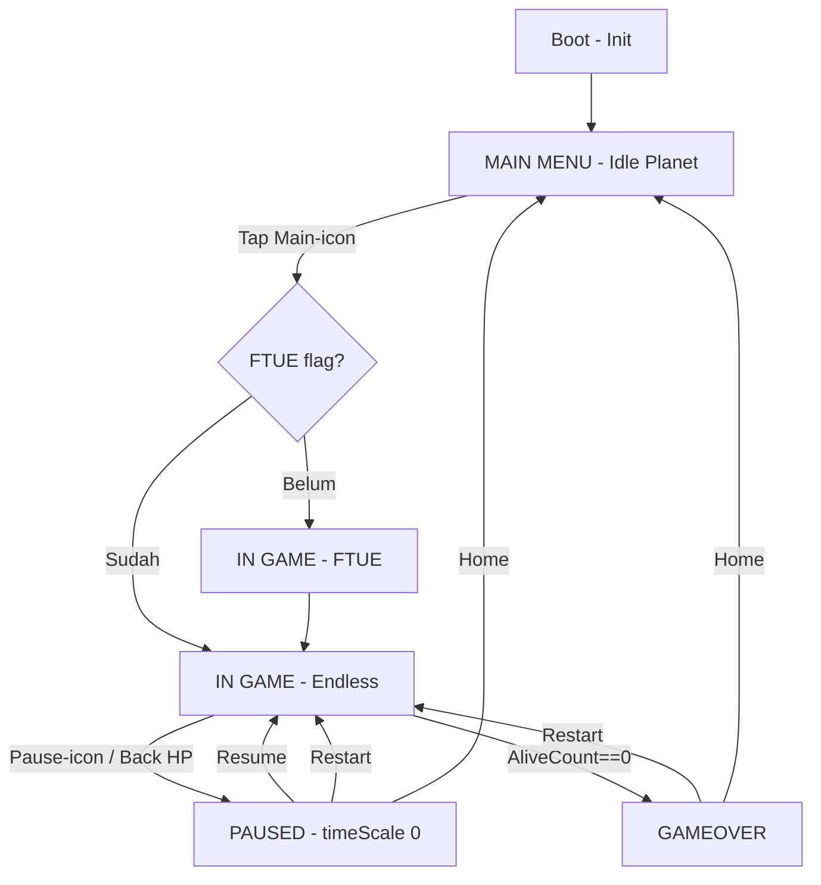

# Planning - Awan Tukang Hujan

> Planning eksekusi terpisah dari GDD. GDD (What/Why) di [[GDD - Awan Tukang Hujan]]. Di sini hanya How/When. Hub: [[Awan Tukang Hujan]].
> Update: satu planet memiliki 80 slot (64 soil + 16 water).

---

## 1. Flow Full: Main Menu → In Game → Pause → Main Menu + GameOver



**GameState enum:** `Boot, MainMenu, Playing, Paused, GameOver` + `OnStateChanged`. Semua sistem lock input / freeze timer berdasarkan ini.

- **Boot (1-2 dtk):** Init GameManager, Pool, Factory, Audio, load BalanceConfigSO (SSOT, termasuk soilCount=64, waterCount=16, initialPlantCount=32) + FTUE flag. Splash ikon awan saja.
- **MainMenu:** Planet auto-rotate pelan, 2 awan dummy drift, tanaman demo. UI ikon: [Main-awan besar], [Mute], [Ulang FTUE]. Drag planet boleh, drag awan locked. Tap Main → fade → Playing.
- **Playing (Endless, no win):** HUD cuma Pause kiri-atas. Input: drag awan (clamp Y), overlap merge hold 0.4 dtk + snap, edge 15% → rotate planet + panah, drag tanah → rotate manual, stay atas air 1 dtk → evaporasi tick. Bunga = visual only. Lose check `PlantManager.AliveCount==0` → GameOver (planet desaturate + awan fade + musik menipis). Tidak ada celebration menang.
- **Paused:** Trigger pause btn / Back HP / OnApplicationPause. timeScale 0, freeze semua. Panel: Resume (play), Restart (putar), Home (planet). Resume +0.5 dtk grace. Restart reset Run saja (80 slot reset: 64 soil kering ulang + 16 water, tanaman hidup ulang sesuai initialPlantCount=32, 2 awan Normal). Home lerp rotasi ke 0.
- **GameOver:** Trigger tunggal tanaman habis. Panel ikon: Restart + Home + ikon planet kering (tanpa skor/teks). Restart langsung Playing, Home ke MainMenu.
- **Fail-safe:** Awan kecil habis → puff hilang. Semua awan hilang tapi tanaman hidup → force spawn 1 Normal 2 dtk (anti softlock).

## 2. Scene Breakdown (1 Scene: `Game`)

```
Game
├── Boot (GameManager, BalanceConfigSO, EventChannels)
├── World
│   ├── PlanetRoot (PlanetRotator rotate Z)
│   │   ├── SoilSlots x64 (SoilSlot.prefab + Puddle child, loop spawn melingkar)
│   │   ├── WaterSpots x16 (spawner + evaporasi zone, selang-seling antar soil)
│   │   └── PlantSpots x32 initial (maks 64, 1 per soil, parent ke SoilSlot)
│   └── Sky (CloudManager, PlantManager-AliveTracker)
│       ├── Clouds (pooled, max 5) + RainFX (pooled)
├── Systems (InputManager, CloudFactory, PoolManager, AudioManager)
└── UI Canvas (HUD-PauseOnly, MainMenuPanel, PausePanel, GameOverPanel - MVP)
```

Kamera ortho fixed. Tanah/air/tanaman child PlanetRoot (ikut muter, total 80 slot). Awan/hujan child Sky. Spawn 80 slot via loop data (jangan drag manual satu-satu), layout selang-seling diatur di BalanceConfig planetLayout.

## 3. Arsitektur Implementasi Checklist

- Core.asmdef: GameManager Singleton, GameState, EventChannelSO 6 biji, BalanceConfigSO (tambah soilCount=64, waterCount=16, initialPlantCount=32), Singleton<T>.
- Feature.Cloud: CloudController + CloudStateMachine (Small 8 dtk / Normal 40 dtk / Dark auto-rain) + Factory + VisualSO.
- Feature.Soil: SoilSlot x64 + State Dry/Wet + Dirty Flag visual lerp (wajib, jangan update 64 tiap frame).
- Feature.Plant: PlantController + State Seed/Growing/Thirsty/Dead/BloomVisual + PlantManager AliveCount (initial 32, maks 64).
- Feature.Planet: PlanetRotator (max 60 deg/dtk + easing, tahan 80 slot) + EdgeScrollDetector (85% x) + EvaporasiZone x16.
- Feature.Input: bedakan drag awan vs drag tanah vs edge, deadzone jelas.
- Feature.FX: RainPool, PuddlePool, UapPool via UnityEngine.Pool (pool size sesuaikan 80 slot).
- UI.asmdef: MVP 4 presenter (MainMenu, HUD-Pause, Pause, GameOver). Full ikon, no teks/angka.
- Audio.asmdef: Event→SFX map (pop merge, hujan loop, tumbuh, mati, gameover thin) + BGM chill 2-bar loop FL Studio + adaptive layer hujan/mekar.

Pola wajib: SSOT, SOLID, Runtime State Separation (Persistent FTUE vs Run), Layered Architecture, Observer decoupled, Flyweight shared SO.

## 4. Balancing Anchors v0.1 (SSOT, tuning via Spreadsheet)

- planet: 80 slot (soilCount 64, waterCount 16), tanaman initialPlantCount 32 (maks 64, tunable)
- cloudSmallLife 8, cloudNormalLife 40, mergeHold 0.4, snapRadius 0.6
- evaporateTick 1.0, rainToWet 2.0, soilWetDuration 25
- plantGrow 15, thirsty 10, death 12, bloomVisual 20 (hiasan)
- planetRotate 60 deg/dtk, edgeZone 15%
- start: 2 Normal, max 5 awan, emergency 2 dtk
- lose: AliveCount==0. No win target.

Resource flow endless: `Air (16 spot, tak terbatas tapi perlu muter) → Awan (max 5, terbatas lifetime) → Basah (64 soil, sementara) → Hidup (32 tanaman, butuh rutin)`. Lihat [[Map Resource Flows]] + [[Establish Math Anchors]]. 16 water vs 64 soil = cari air jadi bagian tantangan rotasi.

## 5. Task 2 Minggu (Solo)

**Minggu 1 — Core Fun:**
1. Core + GameManager enum 5 state + EventChannel + BalanceConfigSO (tambah 64/16/32)
2. PlanetRoot + 80 slot whitebox (64 soil + 16 water, loop spawn) + drag rotate
3. Cloud drag + merge overlap + hujan placeholder
4. Soil Dry/Wet x64 + Dirty Flag
5. Plant state + AliveTracker (initial 32) + GameOver placeholder
6. Playtest 2 menit: merge-hujan-tumbuh jalan?

**Minggu 2 — Flow + Juice:**
7. Factory + Pool ganti sprite awan lucu (pool size untuk 80 slot)
8. Edge-scroll + panah + clamp/easing
9. UI MVP: MainMenu + HUD Pause + Pause + GameOver (tanpa skor)
10. FTUE 5 langkah + PlayerPrefs flag
11. Audio decoupled + BGM loop
12. Balancing survival 80 slot + build APK + playtest buta 5 menit

## 6. Go / No-Go + Skill List

- **Lolos:** baru tanpa teks bisa merge + hujan + muter 80 slot + bertahan >3 menit, mau retry.
- **Gagal:** edge salah >3x, merge random, mati <1 mnt / bosen >10 mnt, drop FPS karena 80 slot (harus atlas + dirty flag + pool) → tuning SO/optim dulu.

**Skill dipakai:** [[Deconstruct Mechanics]], [[Identify Core Loops]], [[Designing FTUE (First-Time User Experience)]], [[Tutorial Level Building Blocks]], [[Level Design Workflow (Whiteblocking & Modular)]], [[Single Source of Truth (SSOT)]], [[Centralized State Manager (GameManager Singleton & Event)]], [[Simple FSM Berbasis Enum (Game State Prototyping)]], [[State Pattern (Unity FSM)]], [[Observer Pattern Events]], [[Factory Pattern (Unity)]], [[Object Pool Pattern (Unity)]], [[SOLID Principles (Unity)]], [[Runtime State Separation]], [[Layered Architecture Stabilization]], [[MVP Pattern (Unity UI)]], [[Dirty Flag Pattern (Unity)]], [[Flyweight Pattern (Unity Shared Data)]], [[Apply Balance Foundations]], [[Map Resource Flows]], [[Establish Math Anchors]], [[Spreadsheet Setup]], [[Decoupled Audio System (Event Channel & Pooling)]], [[Adaptive Audio (Vertical Layering & Horizontal Resequencing)]], [[Teori Musik Dasar untuk Game BGM]], [[Prospect & Refuge Spatial Design]], [[Framework Kihon-Kata-Kumite (Learning Curve & Encounter Design)]].

---
Next: eksekusi Phase 0 — Core + Planet 80 slot whitebox + AliveTracker.
