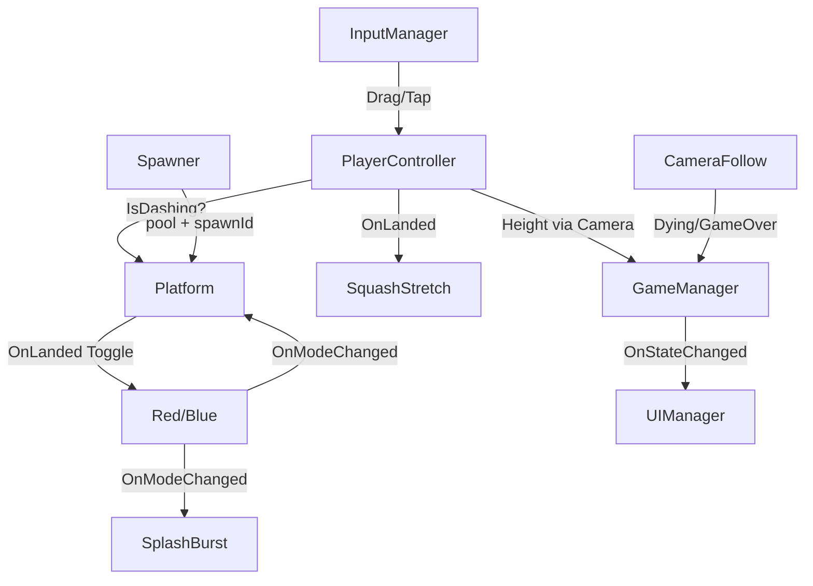

# 💻 TDD - Ball Jumper (Technical Design Document)

> *Sumber kebenaran teknis per 14 Sep 2026 — dibaca langsung dari engine via MCP Unity (port 7892), bukan tebakan. Hub: [[Projects/Ball Jumper/Ball Jumper]] | GDD: [[GDD - Ball Jumper]]*
> *Project: `C:/Users/Paganisium/Documents/Projects/Unity/Gamejam Internal GT 2026` | ProductName `Ball Jumper` (sebelumnya Pair Jump, kode tetap `Assets/_PairJump/`) | Unity `6000.6.0f1` | Scene: `SampleScene`*

---

## 1. Ringkasan Teknis

| Item | Detail aktual (scene, 14 Sep 2026, update post-fix web) |
|------|----------------------------------------------------------|
| **Engine** | Unity 6 (6000.6.0f1), URP, Android platform, IL2CPP, Linear |
| **Orientasi** | Portrait 1080x1920, 60fps lock (`Application.targetFrameRate=60` di `GameManager.Awake`) |
| **Input** | Input System only. Drag gerak + tap dash (Plan B). Tap = cepat ≤0.25s + geser ≤20px baseline (diskala DPI `max(20, dpi×0.12)` di HP), mulai di atas UI diabaikan. Multi-touch: 1 jari drag + 1 jari tap. HUD non-blokir (3 teks `raycastTarget=false`, `DynamicCanvas` tanpa Raycaster — fix blink 14 Sep) |
| **Fisika** | 1x `Rigidbody2D` Dynamic (Player, damping 0, `NeverSleep`, `Continuous`, `Interpolate`; `gravityScale` 0 saat MainMenu karena hold, 3 saat Playing). Gerak X via `rb.position` (teleport velocity-preserving) — JANGAN `MovePosition` / `transform.position` |
| **Scene stat** | 48 GameObject, 168 component (was 169 — `GraphicRaycaster` DynamicCanvas dicabut). Top: RectTransform 36, CanvasRenderer 32, Text 20, Transform 12, Image 12, Animator 10, Button 8, Canvas 4, CanvasScaler 4, SafeAreaPad 4 |
| **Script** | 15 file di `Assets/_PairJump/`: Core 6 (CameraFollow 127, FtueHints 133, GameManager 104, GameState 15, PairJumpInput 184, Spawner 398), Player 5 (PlayerController 397, PlayerMode 2, PlayerSfx 78, PlayerSplashBurst 51, PlayerSquashStretch 148), Platform 1 (Platform 203), UI 3 (ComboFxText 168, SafeAreaPad 121, UIManager 229) |
| **Prefab** | `Assets/_PairJump/Prefab/Platform.prefab` — ter-wire di `Spawner.platformPrefab`, spawn via pool + fallback kotak prosedural |
| **Animasi** | Platform: state `Solid` ↔ `Platform Not Solid` via bool `isSolid` + `snap` (potong transisi 0.25s saat spawn). Player: `Ball Sprite` (SpriteRenderer + Animator) + squash-stretch kode + `Splash Particle` |
| **Audio (fix web 14 Sep)** | 12 wav Vorbis, `preload=true` + `loadInBackground=true` (was false/false — first-play silence di HP). `UIManager.menuSfx`: Play bunyi splash (unlock AudioContext) + tes bunyi saat unmute |
| **Spawner tuning (scene)** | `prewarm=12`, `gapMinY=1.5`, `gapMaxY=2.4`, `maxGapX=2.5`, `greenBailoutEvery=5`, zona `30 / 60 / 90`, `edgeFraction=0.15`, `maxEdgeStreak=2`, `prewarmPool=15`, `maxPoolSize=40` |
| **Kamera (scene)** | `target=Player/Ball Sprite`, `deathBuffer=1.0`, `gameOverAnchor=WorldspaceCanvas`, `panelOffset=8`, `fallSpeed=18.5` |

Struktur folder aktual:
```
Assets/_PairJump/
├── Core/ CameraFollow.cs, FtueHints.cs, GameManager.cs, GameState.cs, PairJumpInput.cs, Spawner.cs
├── Player/ PlayerController.cs, PlayerMode.cs, PlayerSfx.cs, PlayerSplashBurst.cs, PlayerSquashStretch.cs
├── Platform/ Platform.cs
├── Prefab/ Platform.prefab
└── UI/ ComboFxText.cs, SafeAreaPad.cs, UIManager.cs
```
Tambahan asset: `Assets/Art/Sound On.png`, `Assets/Art/Sound Off.png`, `Assets/Font/NanumPenScript-Regular.ttf`.

## 2. Scene Hierarchy (aktual `unity_scene_hierarchy`, 48 objek)

```
Main Camera (Camera, AudioListener, CameraFollow, target=Player/Ball Sprite)
├── Background (SpriteRenderer)
Global Light 2D
InputManager (PairJumpInput)
Player (Rigidbody2D, CircleCollider2D, SpriteRenderer, PlayerController, PlayerSquashStretch, PlayerSplashBurst, PlayerSfx) pos (0,1,0)
├── Ball Sprite (SpriteRenderer, Animator)
├── Splash Particle (ParticleSystem, ParticleSystemRenderer)
Spawner (Spawner, player=Player, platformPrefab=Platform.prefab)
GameManager (GameManager)
EventSystem (EventSystem + InputSystemUIInputModule)
UIManager (UIManager, wiring lengkap — lihat §3.10)
StaticCanvas (kosong, reserved)
DynamicCanvas (HUD saat Play)
├── HeightText + LiveBestText (masing-masing + SafeAreaPad)
├── StreakText (+ SafeAreaPad + ComboFxText)
OverlayCanvas [selalu aktif — jangkar wiring tombol]
├── MainMenuPanel → TitleText, SubtitleText (inactive), MenuBestText, PlayButton, MuteButton (Text legacy + Sound Image), HowtoText (inactive)
├── PausePanel (inactive) → PauseTitle, ResumeButton, PauseRestartButton, PauseMenuButton
├── PauseButton (inactive saat menu, + SafeAreaPad)
WorldspaceCanvas (layer UI, scale dunia) → GameOverPanel (panel dunia Doodle, DIPAKAI)
├── GOTitle, FinalHeightText, NewBestText, FinalBestText, RetryButton, GOMenuButton
FtueHints (FtueHints, bikin 3 hint world-space saat runtime)
```

Perbedaan vs TDD 12 Sep: GameOverPanel PINDAH Overlay → Worldspace (bukan duplikat nganggur lagi); Player punya 3 script juice + 2 anak visual; Camera target = Ball Sprite (bukan root).

---

## 3. Spesifikasi Tiap Script

### 3.1 `Core/GameState.cs` — 15 baris
Enum FSM: `MainMenu, Playing, Paused, Dying, GameOver`.
`Dying` = fase jatuh bebas Doodle (timeScale 1, fisika jalan, input/land mati). Jangan tambah state baru tanpa butuh.

### 3.2 `Core/GameManager.cs` — 104 baris, Singleton SSOT
- `Instance`, `CurrentState`, `BestHeight`, `CurrentHeight`, `IsNewBest`
- `static event Action<GameState> OnStateChanged` — semua UI/player listen, tidak ada polling state.
- `BestKey = "pairjump_best"` (legacy, dipertahankan), `MuteKey = "pairjump_mute"` publik (dipakai UIManager + PlayerSfx, fix #4).
- `UpdateState()`: satu-satunya yang boleh set `timeScale` (0 saat Paused/GameOver, 1 saat Playing/MainMenu/Dying).
- `SubmitHeight(h)`: update Current + Best + flag NewBest. Dipanggil tiap frame dari `UIManager.Update` (saat Playing) + sekali dari `CameraFollow` saat jatuh selesai. Save `PlayerPrefs` HANYA saat `GameOver`.
- `static bootPlaying`: survive reload. `Retry()` → boot Playing, `ToMenu()` → boot MainMenu.

### 3.3 `Player/PlayerMode.cs` — 2 baris
`enum PlayerMode { Red, Blue }`. Hijau bukan mode, cuma warna platform netral.

### 3.4 `Player/PlayerController.cs` — 397 baris
Tuning scene (bukan default kode): `normalGravity=3`, `dashGravityMult=3.5`, `hangTime=0.85`, `moveSensitivity=1.2`, `dashCooldown=0.15`, `dashSlamVelocity=-2`, `dashTimeout=3`, `landDebounce=0.1`, `landTol=0.5`, `landSnapEps=0.02`, `debugAutoDragPxPerFrame=0`. `sr` ter-wire ke `Ball Sprite`.
- `jumpVelocity = hang * g / 2` dengan `g=9.81*3` → ~12.5, lompat maks ~2.65. Bounce pertahankan `x*0.3`.
- `Awake`: `freezeRotation`, `NeverSleep`, `Continuous`, `WakeUp()`, `ballRadius` live dari CircleCollider. Fisika: `Interpolate` (lihat FixedUpdate).
- Event: `OnModeChanged`, `OnDashChanged`, `OnStreakChanged`, `OnLanded(wasDash)` (untuk squash-stretch).
- `Start` + `HandleGameState`: hold total saat bukan Playing (`velocity=0 + gravityScale=0`). Masuk Playing: resume `savedVel` kalau >0.5 else luncur `jumpVelocity` + `canDash=true`. `Dying`: fisika JALAN, input/land mati, `IsDashing=false`, `canDash=false`. Keluar Playing: simpan `savedVel`. `GameOver/MainMenu` → `ResetStreak()`; `Paused` TIDAK reset.
- `HandleDashRequest` (listen `OnTap`): gate `IsPlaying` + `canDash` (sekali per lompatan, strict — pause tidak memberi gratis) + cooldown → `gravityScale=3*3.5`, slam-cut `(vx*0.5, -2)`.
- `FixedUpdate`: px→world, sens 1.2 (0.6 saat dash). **Geser X via `rb.position` — JANGAN `MovePosition`** (berantem dengan `velocity.y` → beku Y) **dan JANGAN `transform.position`** (rewind pose render saat Interpolate → apex bocor ~17%). `Wrap()` + `prevBottomY` di akhir.
- `TryLand(Platform p)`: gate `IsPlaying` + jatuh (`vy>0.5` ditolak kecuali dash) + `ShouldLand(prevBottom, platTop, tol)` (3 param — top-crossing murni). Lalu: `IsSolidFor?` → debounce 0.1 → dash? toggle Red<->Blue → streak Plan A (beda +1 / sama 0 via `spawnId` pool-safe + fallback referensi) → snap `y = platTop+radius+0.02` → bounce `vy=jumpVelocity` + `canDash=true` → `OnLanded(wasDash)` → `p.Boink()` → `sfx.PlayLand` (hanya platform baru).
- `Update`: timeout dash 3s (cancel-on-rise dihapus Plan B). `RefreshAllPlatforms()` via registry Spawner (fix #2), fallback Find.

### 3.5 `Core/PairJumpInput.cs` — 184 baris, tap dash (TETAP)
- Event statik: `OnDragDeltaPixels`, `OnTap`. `OnSwipeDown` DIHAPUS total Plan B.
- `tapMaxDistPx=20`, `tapMaxTime=0.25`. `Awake`: `dpi>0` → `max(20, dpi*0.12)`.
- `IsTap(dt, dist, maxTime, maxDist)` statik murni (unit-testable). `PointerState` per touchId + `MouseId=-100`. `Began` skip `IsOverUI`. Multi-touch: drag + tap bersamaan.

### 3.6 `Platform/Platform.cs` — 203 baris, TopY + animasi + Boink
- `enum PlatformColor { Red, Blue, Green }`, `col.isTrigger=true` (dipaksa di `Awake`).
- `spawnId` + `OnSpawned(id)` monoton (tidak reuse — streak aman saat recycle). `PrepareForSpawn()` restore skala post-boink + `KillBoink()`.
- `TopY` = `col.bounds.max.y` (tahan ganti art) — dipakai gate + snap.
- Visual: `visualRenderer` auto (yang punya sprite, child dulu). `platformAnimator` auto child + `SetBool("isSolid")` → `Solid` ↔ `Platform Not Solid`. Tint identitas, alpha SELALU 1 (hanya fallback prosedural tanpa Animator yang pakai 0.25). `RefreshVisual(mode, dash, snap=false)` — `snap` pakai `Animator.Play` agar spawn/Awake tidak flash (fix visual biru-solid).
- `Boink()` (DOTween, visual child saja — collider root tidak tersentuh): `boinkSquashX=1.25`, `boinkSquashY=0.55`, `in=0.07s`, `out=0.28s` + curves. `OnDisable` → `KillBoink()`.
- `IsSolidFor`: dash → semua solid; normal → hijau selalu, merah/biru butuh mode cocok.
- `OnTriggerEnter/Stay → TryLand`: delegasi penuh ke Player.

### 3.7 `Core/Spawner.cs` — 398 baris, refleksi tepi + pooling
Tuning scene: `prewarm=12`, `gapMinY=1.5`, `gapMaxY=2.4`, `maxGapX=2.5`, `greenBailoutEvery=5`, zona `greenOnlyUntilY=30`, `twoColorUntilY=60`, `tutorialUntilY=90`, `edgeFraction=0.15`, `maxEdgeStreak=2`, `prewarmPool=15`, `maxPoolSize=40`. `player` + `platformPrefab` ter-wire.
- `bound = max(1, halfW − halfWidth − 0.2)` (platform full on-screen). `ReflectX(lastX, roll, bound)` pantul (bukan clamp). Anti-run tepi max 2x.
- `OnValidate`: zona wajib menaik; `gapMaxY>2.55` warning (batas fisika lompat maks ~2.65).
- `PickColor(y)`: `<30` hijau; `<60` hijau/merah 50/50; `<90` pola tutorial deterministik 12 langkah; `90+` 35/32/33 + bailout tiap 5 non-hijau.
- Pooling Day 3: `Queue<Platform> pool`, `TotalCreated` (harus plateau) / `TotalSpawned` (naik terus), `CreatePlatformObject()` (prefab/fallback), `GetFromPool()` (skip hantu), `ReleaseToPool()` (nonaktif; overflow Destroy), `SpawnAt()` = ambil pool → `PrepareForSpawn()` → posisi → `OnSpawned(nextSpawnId++)` → `SetActive(true)` → `RefreshVisual(mode live, dash live, snap=true)` → `live.Add`. `Update`: spawn guard 10/frame, recycle di bawah kamera. `RefreshAllPlatformVisuals(mode, dash)` via registry `live` (no alloc, fix #2).
- Fallback prosedural: kotak `2.2×0.4` + `MakeSquare` cache.

### 3.8 `Core/CameraFollow.cs` — 127 baris, Doodle GameOver
Tuning scene: `target=Player/Ball Sprite`, `deathBuffer=1.0`, `gameOverAnchor=WorldspaceCanvas`, `panelOffset=8`, `fallSpeed=18.5`.
- `Height = max(0, highestY-startY)` (tidak turun saat kamera turun).
- `Playing`: naik-only + panel standby di `highestY - ortho*2 - panelOffset`.
- Jatuh lewat `highestY-ortho-deathBuffer` → `fallStarted` → `UpdateState(Dying)` (score freeze).
- `Dying`: panel STAY di `lockedPanelY`, kamera `MoveTowards` bola (`fallSpeed`) sampai sejajar → `SubmitHeight(Height)` → `UpdateState(GameOver)`.
- Freeze total saat bukan Playing/Dying. `PositionAnchor` paksa `x=0`. Jangan paksa scale dari kode (sudah 0.01 di scene).

### 3.9 `Core/FtueHints.cs` — 133 baris
Tuning scene: font `NanumPenScript-Regular`, `HintMoveY=6 "DRAG TO MOVE"`, `HintColorY=36 "STEP ON THE RIGHT COLOR"`, `HintDashY=66 "TAP TO SWITCH"`, tampil `move<28`, `color 28-78`, `dash 58-128`. Canvas world-space tanpa Raycaster (tidak blokir input), scale 0.005, size 1400x300.
- `OnValidate` + `RepositionLiveHints()`: cegah rentang terbalik + posisi di luar rentang.
- `Update`: hide total saat `Dying/GameOver` (kamera turun = hint lama bisa nongol lagi).

### 3.10 `UI/UIManager.cs` — 229 baris
Semua ter-wire (lihat tabel): panel MainMenu/Pause (Overlay) + GameOver (Worldspace) + PauseButton; teks Height/LiveBest/MenuBest/FinalHeight/FinalBest/NewBest; `muteIcon=Sound Image` + `soundOn/OffSprite` wired; `muteText` LEGACY dikosongkan.
- `Btn` consts (fix #1, SSOT-D): Play/Pause/Resume/PauseRestart/PauseMenu/Retry/GOMenu/Mute.
- `OnEnable`: subscribe `OnStateChanged` + `WireButtons()` (idempoten remove-then-add). `WireButtons` sisir DUA canvas (Overlay + Worldspace) via `GetComponentsInChildren<Button>(true)` — JANGAN `Find` (buta inactive).
- `Update`: hanya saat Playing → `SubmitHeight(Height)` + `heightText "Nm"` + `liveBest`.
- `HandleState`: MainMenu/Pause/GameOver show-hide + isi skor dunia (final/best/NewBest jika `IsNewBest && h>0.5`) + best menu. `gameOverPanel` tidak di-SetActive dari kode (panel dunia standby di bawah kamera).
- Tombol: Play/Resume→Playing, Pause→Paused, Restart→`Retry()`, Menu→`ToMenu()`, Mute→toggle `MuteKey` + `RefreshMuteVisual()` (ikon, bukan teks).
- FIX web (post-gamejam 14 Sep): `menuSfx` (auto-find `PlayerSfx`) — `OnPlayPressed` bunyi splash (gesture = unlock AudioContext HP) + `OnMutePressed` bunyi tes saat unmute. Null-safe.
- Streak TIDAK di sini lagi — pindah ke `ComboFxText` (single responsibility).

### 3.11 `UI/SafeAreaPad.cs` — 121 baris, anchor-aware (TETAP)
`ComputePad` statik murni (unit-testable): stretch → pad offset + clamp; single-point → size UTUH + geser `anchoredPosition`; center diam; partial → sisi nempel saja. Idempoten + no-op bila inset nol. Terpasang di: PauseButton, HeightText, LiveBestText, StreakText.

### 3.12 `Player/PlayerSfx.cs` — 78 baris (BARU vs TDD 12 Sep)
- List inspector: `landGreen/landRed/landBlue`, `splash`. Scene: `landVolume=1`, `splashVolume=1` (list clip belum dibaca — null-safe).
- `PlayLand(color)` pilih list per warna; `PlaySplash()` tiap ganti mode (dipanggil `PlayerSplashBurst`).
- `Pick`: acak tanpa pengulangan langsung, slot null dilewati. `Play`: hormati `MuteKey`, `pitch=1` (piano — variasi murni dari list, tanpa pitch shift), `PlayOneShot`.

### 3.13 `Player/PlayerSplashBurst.cs` — 51 baris (BARU)
Juice tiap toggle: listen `OnModeChanged` (hanya fire dari cabang dash → otomatis dash-only) → tint `startColor` mode BARU (`redBurst/blueBurst`) → `Stop+Clear` → `Play()` → `sfx.PlaySplash()`. Refs auto: `player`, `splash` (child ParticleSystem, tahan rename), `sfx`.

### 3.14 `Player/PlayerSquashStretch.cs` — 148 baris (BARU)
Juice bola (DOTween, visual `Ball Sprite` saja — collider root tidak tersentuh). Scene: `visual=Ball Sprite`, `rb=Player`, `player=Player`, `velocityReference=12.5`, `maxStretchBonus=0.6`, `smoothSpeed=12`, `landSquashDuration=0.08`, `landRecoverDuration=0.22`, `maxSquashX=1.5`, `minSquashY=0.5`, `normalLandStrength=0.6` + curves.
- `Update`: velocity stretch vertikal (`|vy|/ref` via curve + preserve volume `sx=1/sy` + clamp) — jalan saat Playing/Dying, balik base di luar itu.
- `OnLanded(wasDash)`: squash horizontal (dash 100%, normal 60%) via Sequence + `KillSquash()` di `OnDisable`/ganti state.

### 3.15 `UI/ComboFxText.cs` — 168 baris (BARU)
Floating combo (`StreakText`): follow `Player` + `worldOffset (0,1.4,0)` via WorldToScreen → canvas local tiap `LateUpdate` (Overlay canvas, anchor wajib center 0.5).
- `n>0`: snap ke atas bola → punch-scale (`idleScale=1` → `growScale=1.35`, `grow 0.15s OutBack` → `settle 0.25s`) + teks `xN`.
- `n==0` (hanya bila sebelumnya kelihatan): fade + drop 60px (`0.4s`) → sembunyi. Semua parameter inspector-driven.

## 4. Alur Data & Event

```
Touch/Mouse → PairJumpInput (dx px / OnTap) → PlayerController (queue drag, dash jika canDash)
Platform trigger → PlayerController.TryLand → IsSolidFor? → toggle mode?
  → OnModeChanged → RefreshAllPlatformVisuals (registry live) + UpdateColor + SplashBurst
  → OnDashChanged → refresh visual
  → OnStreakChanged → ComboFxText (follow bola)
  → OnLanded(wasDash) → SquashStretch + Boink + Sfx
CameraFollow.Height → UIManager.Update (Playing saja) → GameManager.SubmitHeight → Best
CameraFollow jatuh → Dying (freeze skor) → kamera susul bola → GameOver → UIManager isi teks dunia
Spawner pool: Create → live → ReleaseToPool → GetFromPool (spawnId monoton, tidak reuse)
Tombol → UIManager (2 canvas) → GameManager.UpdateState / Retry / ToMenu (reload scene)
```



## 5. Pattern & Skill Vault Terkait

- ✅ Simple FSM Enum (`GameState` 5 state, `PlayerMode`) — [[Simple FSM Berbasis Enum (Game State Prototyping)]]
- ✅ Centralized State Manager + SSOT (`GameManager` satu-satunya pemilik state/best; `MuteKey`, `Btn` consts) — [[Centralized State Manager (GameManager Singleton & Event)]] + [[Single Source of Truth (SSOT)]]
- ✅ Observer (`OnStateChanged`, `OnModeChanged`, `OnDashChanged`, `OnStreakChanged`, `OnLanded`) — [[Observer Pattern Events]]
- ✅ Object Pooling (`Spawner` queue + `PrepareForSpawn`, `TotalCreated/TotalSpawned`) — SELESAI Day 3 (dulu tech debt)
- ✅ FTUE zonasi + hint in-world (inspector-driven, sinkron Spawner) — [[Tutorial Level Building Blocks]] + [[Framework Kihon-Kata-Kumite (Learning Curve & Encounter Design)]]

---

## 6. Tech Debt & Risiko (update 14 Sep)

1. SELESAI: pooling ✅, Doodle GameOver ✅, refresh registry ✅, Btn consts ✅, MuteKey SSOT ✅, sole-writer teks dunia ✅, juice (squash/splash/combo/boink/sfx) ✅, font NanumPen ✅, ikon mute ✅, bundle ID `com.Paganisium.BallJumper` ✅, webCanvas portrait 540x960 ✅.
2. SISA / AWASI:
   - `CameraFollow` scene (`deathBuffer=1.0`, `panelOffset=8`, `fallSpeed=18.5`) beda jauh dari default kode (2.5/3/12) — JANGAN revert tanpa feel-test King. Zona Spawner scene (`30/60/90`, `edgeFraction=0.15`) juga beda dari default kode (30/60/90 sama, tapi edge default kode 0.75) — scene yang menang.
   - `PlayerController.landTol` scene 0.5 (TDD lama 0.1) — penjamin apex + snap; awasi pop visual saat dash kencang, kecilkan `landSnapEps` dulu jangan hapus snap.
   - Web (King, 14 Sep): template masih Default + `runInBackground` False — pertimbangkan template portrait 9:16 + pillarbox + runInBackground True sebelum build web berikutnya.
   - BGM loop belum terverifikasi di TDD ini (cek `Audio/` + `PlayerSfx` clip wiring bila perlu).
   - Jangan edit code saat Play nyala + selalu Refresh habis edit (aturan anti assembly-basi).
   - Kalau King edit transisi Animator manual, tes ulang 2 arah (transisi di-rebuild via API).

## 7. Verifikasi Kebenaran Dokumen Ini

- Dibaca 14 Sep 2026 via `unity_asset_list` (21 aset, 15 MonoScript), `unity_script_read` 15/15, `unity_component_get_properties` (Spawner, PlayerController, CameraFollow, PairJumpInput, FtueHints, Rigidbody2D, UIManager, PlayerSfx, PlayerSquashStretch), `unity_scene_hierarchy` (48 objek) + `unity_scene_stats` (48/169).
- Semua angka tuning di §1/§3 adalah nilai SCENE (inspector), bukan default kode — bila beda, scene yang menang dan dicatat eksplisit.
- Tidak ada tebakan: `pairjump_best/mute`, `_PairJump`, `PairJumpInput` dipertahankan sebagai identifier legacy (project display `Ball Jumper`).
