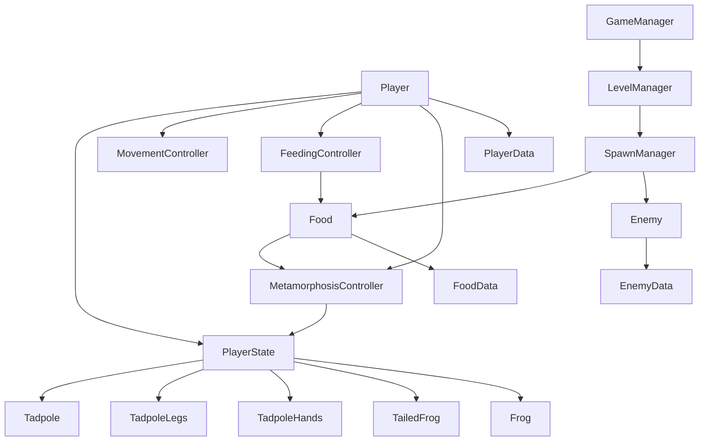

# 🐸 GDD — Frog Life Cycle

## 1. 🎮 Konsep & Identitas Game

**Ringkasan:**  
Game mobile landscape bertema kehidupan katak yang menggabungkan eksplorasi sederhana dengan mekanik **feeding/chasing** seperti _Feeding Frenzy_. Pemain mengendalikan berudu menggunakan analog untuk mencari makanan, memakan alga dan makhluk air yang lebih kecil, sambil menghindari predator yang lebih besar. Dengan mengumpulkan makanan hingga memenuhi batas metamorfosis, pemain berkembang melalui beberapa tahap hingga akhirnya menjadi katak dewasa dan naik ke permukaan.

- **Premis:**  
    _Game ini adalah mobile action-feeding game di mana pemain mengendalikan berudu untuk mencari makanan, menghindari predator, dan berkembang melalui setiap tahap metamorfosis hingga menjadi katak dewasa._
    
- **Genre:**  
    2D/2.5D Action Feeding / Casual Survival
    
- **Target Platform:**  
    Mobile — Landscape
    
- **USP (Unique Selling Point):**  
    Mekanik **feeding ala Feeding Frenzy yang dikombinasikan dengan metamorfosis katak**, sehingga karakter dan kemampuan bermain berubah secara bertahap dari berudu hingga katak dewasa.
    
- **Referensi & Inspirasi:**  
    _Feeding Frenzy_ — terutama konsep memakan makhluk yang lebih kecil untuk berkembang, dengan tema **siklus hidup katak** sebagai twist utama.
    

---

# 2. 🔄 Core Gameplay Loop

Format loop dibuat sederhana agar cocok untuk sesi bermain mobile.

### Loop Utama

**Explore → Cari makanan → Makan → Hindari predator → Penuhi Metamorphosis Meter → Berubah → Area/tahap berikutnya**

Contoh:

> 🐟 Bergerak → 🦠 mencari alga → 🍽️ makan → 🐟 menghindari ikan besar → 📈 meter penuh → 🦵 metamorfosis → lanjut sebagai bentuk baru

### Core Mechanic

**Eat to Evolve**

Pemain harus mengumpulkan makanan untuk mengisi **Metamorphosis Meter**. Ketika meter mencapai batas tertentu, pemain melakukan metamorfosis dan masuk ke tahap berikutnya.

### Daya Tarik Jangka Pendek

- Mencari makanan yang tersebar di lingkungan.
    
- Mengejar makanan yang bergerak.
    
- Menghindari ikan yang lebih besar.
    
- Melihat meter metamorfosis terus meningkat.
    
- Mendapat perubahan visual setiap kali berevolusi.
    

### Daya Tarik Jangka Panjang

- Menyelesaikan seluruh siklus hidup.
    
- Mencapai bentuk katak dewasa.
    
- Menyelesaikan tahap dengan performa yang lebih baik.
    
- Membuka lingkungan atau variasi level baru jika nantinya dikembangkan.
    

---

# 3. ⚔️ Mekanik Utama

Sesuai template, mekanik utama dibatasi agar prototype tetap fokus.

### 1. 🕹️ Analog Movement

Pemain menggerakkan karakter menggunakan **virtual analog**.

- Analog kiri/kanan/segala arah.
    
- Karakter mengikuti arah input analog.
    
- Movement dibuat responsif dan sederhana.
    
- Kamera mengikuti karakter ketika diperlukan.
    

### 2. 🍽️ Feeding

Pemain dapat memakan objek yang memenuhi syarat.

**Contoh makanan:**

- Alga
    
- Makhluk air kecil
    
- Ikan kecil
    

Ketika makanan dimakan:

> **Food → Score/Progress → Metamorphosis Meter +**

Pemain **tidak dapat memakan ikan yang lebih besar**.

### 3. 🐟 Predator Avoidance

Ikan berukuran lebih besar berfungsi sebagai ancaman.

Jika pemain bertabrakan dengan predator:

**Predator → Player terkena damage / kehilangan progress → Player harus kabur**

Tujuannya agar pemain tidak hanya bergerak mencari makanan, tetapi juga harus memperhatikan lingkungan.

### 4. 🧬 Metamorphosis

Setiap tahap memiliki batas progress.

Contoh:

**0% → 25% → 50% → 75% → 100%**

Ketika mencapai 100%:

> **Metamorphosis Trigger → Animasi → Bentuk baru**

### 5. 🌊 Surface Transition

Pada tahap **katak berekor**, pemain harus menemukan jalan menuju **permukaan air**.

Ketika mencapai permukaan:

> **Keluar dari air → metamorfosis terakhir → Katak dewasa → Level selesai**

---

# 4. 💻 Arsitektur Data & Design Pattern

Template GDD menekankan arsitektur modular dan penggunaan design pattern sejak awal.

### Design Pattern Pilihan

**State Pattern**

Sangat cocok untuk perubahan bentuk karakter.

```text
PlayerState
├── Tadpole
├── TadpoleLegs
├── TadpoleHands
├── TailedFrog
└── Frog
```

Setiap state menentukan:

- Movement speed
    
- Ukuran tubuh
    
- Makanan yang dapat dimakan
    
- Predator yang harus dihindari
    
- Animasi
    
- Kondisi metamorfosis
    

### Observer / Event Pattern

Digunakan untuk event seperti:

```text
OnFoodEaten
      ↓
MetamorphosisMeter.AddProgress()
      ↓
OnMetamorphosisReady
      ↓
Player.ChangeState()
```

Dengan demikian sistem makanan tidak perlu mengetahui secara langsung bagaimana karakter melakukan metamorfosis.

### Factory Pattern

Digunakan untuk spawning:

- Alga
    
- Ikan kecil
    
- Ikan besar
    
- Objek lingkungan
    

### Arsitektur Data

Untuk Unity, struktur data dapat menggunakan **ScriptableObject** sebagai sumber data utama.

Contoh:

```text
PlayerData
├── movementSpeed
├── eatingRange
├── maxProgress
└── state

FoodData
├── foodType
├── progressValue
└── requiredStage

EnemyData
├── enemyType
├── speed
├── size
└── damage
```

### Mermaid Diagram



---

# 5. 🏛️ Desain FTUE

Template menyarankan FTUE digunakan untuk mengenalkan mekanik utama secara intuitif.

### Pendekatan FTUE: Contextual Tutorial

Tidak menggunakan tutorial panjang.

Pemain langsung berada di dalam air.

### Tahap 1 — Movement

Muncul:

> **"Geser analog untuk bergerak"**

Kemudian pemain melihat beberapa alga yang mudah dijangkau.

### Tahap 2 — Feeding

Ketika mendekati alga:

> **"Makan untuk tumbuh!"**

Pemain otomatis memakan alga ketika menyentuhnya / berada dalam eating range.

### Tahap 3 — Predator

Setelah pemain mendapatkan beberapa makanan, muncul ikan yang lebih besar.

> ⚠️ **"Hindari ikan besar!"**

Ikan tersebut bergerak melewati area pemain.

### Tahap 4 — Metamorphosis

Meter hampir penuh.

> **"Terus makan untuk berubah!"**

Ketika meter penuh, animasi metamorfosis dimainkan.

---

# 6. 🚀 Struktur Folder Modular & Optimisasi Performa

Template menggunakan pendekatan **Feature-Based/Modular** dan menganjurkan optimisasi sejak awal.

### Struktur Folder

```text
Assets/
│
├── Art/
│   ├── Characters/
│   │   ├── Tadpole/
│   │   ├── TadpoleLegs/
│   │   ├── TadpoleHands/
│   │   ├── TailedFrog/
│   │   └── Frog/
│   │
│   ├── Environment/
│   ├── Food/
│   └── Enemies/
│
├── Audio/
│   ├── SFX/
│   └── Music/
│
├── Prefabs/
│   ├── Player/
│   ├── Food/
│   └── Enemies/
│
├── Scripts/
│   ├── Player/
│   ├── Food/
│   ├── Enemy/
│   ├── Metamorphosis/
│   ├── Level/
│   ├── UI/
│   └── Managers/
│
├── ScriptableObjects/
│   ├── Player/
│   ├── Food/
│   └── Enemy/
│
└── UI/
    ├── HUD/
    ├── Analog/
    └── Metamorphosis/
```

### Rencana Optimisasi

**CPU/Memori**

- Object Pooling untuk ikan dan makanan.
    
- Membatasi jumlah enemy aktif.
    
- Reuse object daripada Instantiate/Destroy terus-menerus.
    

**Rendering**

- Sprite Atlas.
    
- Batasi transparansi berlapis.
    
- Gunakan background layer sederhana.
    
- Pisahkan UI statis dan dinamis.
    

---

# 7. 📏 Scope & Feasibility

### Estimasi Durasi

**Prototype:** 2–3 minggu

Prototype hanya perlu membuktikan:

> **Movement → Eat → Avoid → Grow → Metamorphosis**

**MVP:** 1–2 bulan

Dengan:

- 5 tahap pertumbuhan
    
- Beberapa jenis makanan
    
- Beberapa ikan predator
    
- 3–5 level
    
- UI
    
- Audio
    
- Animasi metamorfosis
    
- Tutorial
    

### Ukuran Tim

**1–3 orang**

Cocok untuk proyek indie / tugas kuliah / prototype game mobile.

### Risiko Teknis

- Movement analog harus terasa responsif.
    
- Collision antara player, makanan, dan predator.
    
- Perubahan karakter saat metamorfosis.
    
- Sistem spawning ikan dan makanan.
    
- Kamera dan perpindahan menuju permukaan.
    
- Optimisasi jika jumlah ikan cukup banyak.
    

### Risiko Desain

Risiko terbesar adalah **gameplay menjadi repetitif** karena loop hanya:

> Makan → Makan → Makan → Metamorfosis.

Karena itu, perbedaan tiap tahap perlu terasa dalam **kecepatan, ukuran, jenis makanan, lingkungan, dan pola predator**, tanpa harus menambah terlalu banyak mekanik.

### Kriteria "Go/No-Go"

Prototype dapat dilanjutkan apabila:

- Movement menggunakan analog terasa nyaman.
    
- Pemain langsung memahami bahwa makanan digunakan untuk berkembang.
    
- Menghindari ikan besar terasa menegangkan tetapi tidak membingungkan.
    
- Progress metamorfosis memberikan motivasi untuk terus bermain.
    
- Perubahan bentuk terasa memuaskan.
    
- Satu siklus dari **berudu hingga katak** dapat dimainkan tanpa terasa monoton.
    

---

# 🐸 Struktur Siklus Utama

Ini bagian yang menurutku paling penting untuk dijadikan **fondasi level design**:

```text
┌─────────────────┐
│  1. BERUDU      │
│                 │
│ Alga + makanan  │
│ kecil           │
│                 │
│ Hindari ikan    │
│ kecil/besar     │
└────────┬────────┘
         │
      Meter 100%
         ↓
┌─────────────────┐
│ 2. BERUDU       │
│    BERKAKI      │
│                 │
│ Lebih cepat     │
│ Makanan baru    │
│ Predator baru   │
└────────┬────────┘
         │
      Meter 100%
         ↓
┌─────────────────┐
│ 3. BERUDU       │
│    TUMBUH TANGAN│
│                 │
│ Bentuk semakin  │
│ mirip katak     │
└────────┬────────┘
         │
      Meter 100%
         ↓
┌─────────────────┐
│ 4. KATAK        │
│    BEREKOR      │
│                 │
│ Cari jalan      │
│ menuju atas     │
└────────┬────────┘
         │
      SURFACE
         ↓
┌─────────────────┐
│ 5. KATAK        │
│    DEWASA       │
│                 │
│     🐸          │
│                 │
│     FINISH      │
└─────────────────┘
```

### Konsep progresi yang saya sarankan

Jangan hanya membuat **"meter penuh = ganti sprite"**. Setiap metamorfosis sebaiknya terasa seperti **unlock gameplay**.

|Tahap|Makanan|Ancaman|Fokus Gameplay|
|---|---|---|---|
|**Berudu**|Alga + organisme kecil|Ikan kecil/besar|Belajar movement|
|**Berudu berkaki**|Alga + ikan kecil|Ikan lebih besar|Mulai mengejar makanan|
|**Berudu tumbuh tangan**|Ikan kecil + organisme|Predator lebih agresif|Feeding lebih cepat|
|**Katak berekor**|Ikan kecil + makanan khusus|Predator besar|**Cari permukaan**|
|**Katak**|—|—|**Finish**|

Dengan struktur ini, game tetap mempertahankan kesederhanaan **Feeding Frenzy**, tetapi tujuan pemain tidak sekadar mendapatkan skor. Ada tujuan yang jelas:

> **"Aku harus makan cukup banyak supaya berubah menjadi katak."**

Dan endpoint yang sangat jelas:

> **"Aku harus mencapai permukaan untuk menyelesaikan siklus hidup."**