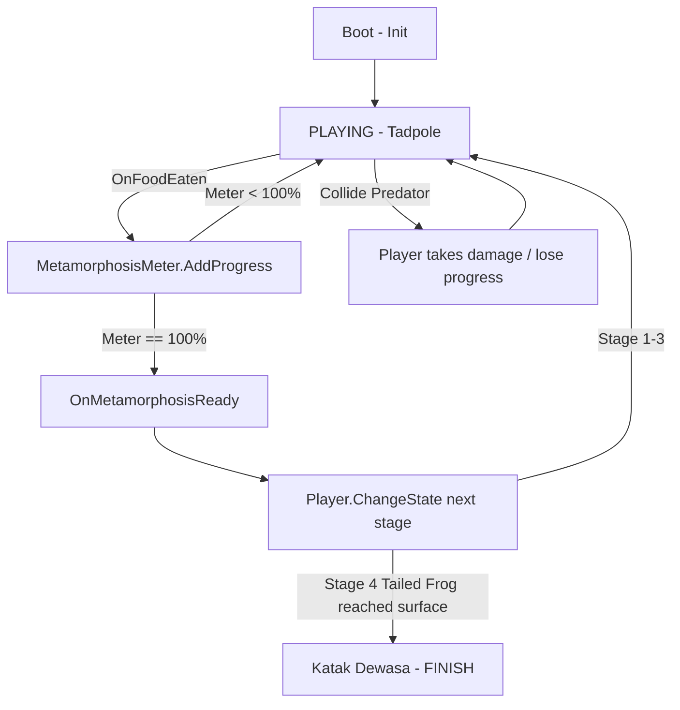

# Planning - Frog Life Cycle

> Planning eksekusi terpisah dari GDD. GDD (What/Why) di [[GDD - Frog Life Cycle]]. Di sini hanya How/When.

---

## 1. Flow Full: State Pattern & Metamorphosis Loop



**PlayerState enum:** `Tadpole, TadpoleLegs, TadpoleHands, TailedFrog, Frog` + `OnStateChanged`. Tiap state menentukan movement speed, ukuran, food yang bisa dimakan, predator yang harus dihindari, animasi, dan kondisi metamorfosis (sesuai tabel di GDD).

- **Boot:** Init GameManager, PoolManager, SpawnManager (Factory), PlayerData/FoodData/EnemyData (ScriptableObject SSOT).
- **Playing:** Analog movement, feeding (trigger overlap dengan Food), predator avoidance (collision dengan Enemy lebih besar), meter naik lewat event `OnFoodEaten`.
- **Metamorphosis Trigger:** ketika meter 100%, `MetamorphosisController` memanggil `Player.ChangeState()`, animasi transisi, reset meter untuk stage berikutnya, food/predator pool di-refresh sesuai stage baru.
- **Surface Transition (stage 4):** kondisi menang beda — bukan meter, tapi mencapai trigger area permukaan air.
- **Finish:** stage 5 (Frog dewasa), level selesai, tanpa loop lanjutan (sesuai GDD, belum ada requirement replay/skor).

## 2. Scene Breakdown (1 Scene: `Game`)

```
Game
├── Boot (GameManager, PlayerData/FoodData/EnemyData SO, EventChannels)
├── World
│   ├── Player (MovementController, FeedingController, MetamorphosisController, PlayerState FSM)
│   ├── SpawnManager (FoodFactory, EnemyFactory, pooled via Object Pool)
│   ├── Environment (area per stage, SurfaceTriggerZone untuk stage 4)
│   └── Camera (follow player)
├── Systems (PoolManager, AudioManager)
└── UI Canvas (HUD - Metamorphosis Meter, FTUE prompts per tahap)
```

Kamera 2D/2.5D landscape mobile mengikuti player. Food & enemy di-spawn lewat Factory + di-pool, bukan Instantiate/Destroy langsung (sesuai rencana optimisasi di GDD).

## 3. Arsitektur Implementasi Checklist

- Core: GameManager, PlayerState enum + [[State Pattern (Unity FSM)]], EventChannel untuk `OnFoodEaten` / `OnMetamorphosisReady`.
- Feature.Player: MovementController (analog input), FeedingController (deteksi food dalam eating range), MetamorphosisController (dengar event, panggil ChangeState).
- Feature.Food & Feature.Enemy: [[Factory Pattern (Unity)]] untuk spawn, [[Object Pool Pattern (Unity)]] untuk reuse object (wajib — GDD eksplisit sebut ini sebagai rencana optimisasi CPU/memori).
- Data: PlayerData/FoodData/EnemyData sebagai ScriptableObject, ikuti [[Single Source of Truth (SSOT)]].
- Event flow: [[Observer Pattern Events]] — FeedingController tidak perlu tahu langsung bagaimana metamorfosis terjadi, cukup broadcast `OnFoodEaten`.
- Rendering/optimisasi: Sprite Atlas, batasi enemy aktif, pisah UI statis/dinamis (sesuai bagian 6 GDD).

## 4. Balancing Anchors v0.1 (SSOT, tuning nanti)

- 5 stage: Tadpole → TadpoleLegs → TadpoleHands → TailedFrog → Frog
- Metamorphosis meter per stage: 0% → 25% → 50% → 75% → 100% (nilai food per stage masih perlu ditentukan lewat [[Model Progress Curves]])
- Food per stage berbeda jenis (alga → ikan kecil → organisme → makanan khusus) agar tidak repetitif — lihat tabel progresi di GDD bagian 7.
- Predator per stage makin agresif; collision = damage/lose progress, bukan instant death (sesuai GDD bagian 3.3).
- Prototype target: buktikan loop Movement → Eat → Avoid → Grow → Metamorphosis dulu, 1 stage cukup.

## 5. Task Bertahap (Prototype dulu, 2–3 minggu sesuai estimasi GDD)

**Minggu 1 — Core Loop (1 stage saja):**
1. ✅ Core: GameManager + PlayerState FSM (mulai dari Tadpole saja) + EventChannel
2. ✅ Analog movement + kamera follow
3. ✅ Food spawn (Factory + Pool) + FeedingController + MetamorphosisMeter
4. ✅ Predator spawn (Factory + Pool) + collision damage
5. ✅ Playtest: apakah loop makan-hindari-meter naik terasa enak sebelum nambah stage lain?

**Minggu 2 — Progresi & Tahap:**
6. Tambah 4 state lanjutan (TadpoleLegs → Frog) via State Pattern, tiap state ganti size/sprite
7. Animasi transisi metamorfosis + reset meter per stage
8. Surface transition trigger untuk stage TailedFrog → Frog
9. FTUE contextual (4 tahap sesuai GDD bagian 5)

**Minggu 3 — Polish & Optimisasi:**
10. Sprite Atlas, batasi enemy aktif, cek performa pooling
11. Audio dasar (feeding SFX, metamorphosis SFX)
12. Playtest buta, cek kriteria Go/No-Go

## 6. Go / No-Go + Skill List

- **Lolos:** movement analog terasa nyaman, pemain paham makanan = progress, hindari predator menegangkan tapi tidak membingungkan, transisi antar stage terasa memuaskan, satu siklus penuh (berudu → katak) bisa dimainkan tanpa monoton.
- **Gagal (Risiko Desain dari GDD):** loop cuma "makan-makan-makan" tanpa variasi terasa — kalau ini terjadi, kembali tuning perbedaan food/predator/lingkungan per stage sebelum nambah fitur baru.

**Skill dipakai:** [[State Pattern (Unity FSM)]], [[Observer Pattern Events]], [[Factory Pattern (Unity)]], [[Object Pool Pattern (Unity)]], [[Single Source of Truth (SSOT)]], [[Model Progress Curves]], [[Level Design Workflow (Whiteblocking & Modular)]], [[Centralized State Manager (GameManager Singleton & Event)]].

---
Next: eksekusi Minggu 1 — Core Loop 1 stage (Tadpole) dulu sebelum nambah 4 stage lain.
