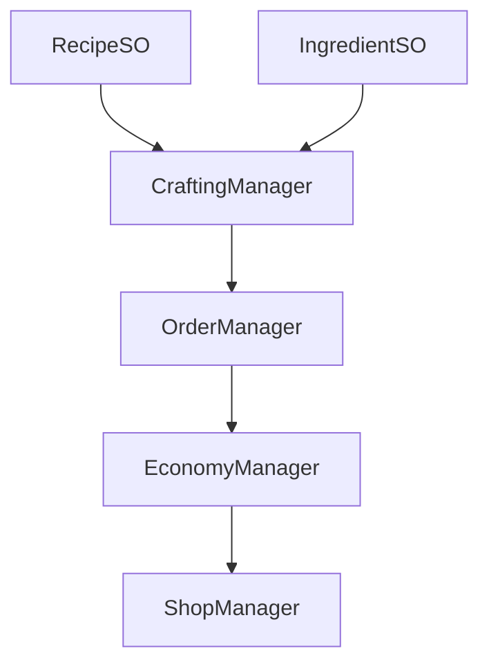

# 📋 GDD — Dukun Chain Reaction (IFEST 2026)

> GDD dibuat mengikuti [[Projects/Ideas/Format Game Design|Format Game Design]]. Versi ini **hanya berisi mekanik yang sudah dikonfirmasi dari screenshot** — ide tambahan dipindah ke Appendix Pending.

---

## 🎮 1. Konsep & Identitas Game

- **Premis**: *Game ini adalah Crafting Puzzle di mana pemain sebagai **Dukun** membuat barang dari beberapa bahan tertentu yang **harus urut**. Barang diberikan ke customer yang memesan, lalu mendapat uang. Uang dipakai untuk membeli bahan lagi.*
- **Genre**: Crafting Puzzle / Shop Loop
- **Target Platform**: PC / WebGL (IFEST Game Jam)
- **Target Persona**: Achiever & Explorer (dari brief IFEST)
- **Tema Jam**: Chain Reaction

**Moodboard — sesuai screenshot 1:**
- **Temanya**: Nusantara, Modern, Urban
- **Keyword**: Kramat, Mantra, Dukun, Sesajen, Ramuan
- **Vibes**: Modern, Misterius, Fun, Mistis, Profesional, JOy
- **Mood Board theme**: Nusantara Modern Urban — kramat tapi fun

---

## 🔄 2. Core Gameplay Loop — CONFIRMED

**Sesuai coretan screenshot 2:**

```
Dukun -> [Combine: 5 slot bahan urut] -> Order -> Output -> Objective (Money) -> Shop -> kembali ke Combine
```

- **Visual di screenshot**: Meja Combine 5 slot (2 slot terisi icon kaki/sepatu), simbol ritual lingkaran pentagram, icon `Sepatu roda` dengan panah ke `Money` (hasil output dijual).
- **Loop Step-by-step (konfirmasi)**:
  1.  **Combine**: Player susun bahan di 5 slot secara berurutan
  2.  **Order**: Pesanan customer menentukan item apa yang harus dibuat (order jadi trigger)
  3.  **Output**: Jika urutan benar, item jadi (contoh di screenshot: Sepatu Roda)
  4.  **Objective**: Item diberikan ke customer, dapat **Money**
  5.  **Shop**: Money dipakai untuk membeli bahan lagi -> loop

> Catatan: Tidak ada mekanik tambahan (Grimoire, rating bintang, fail effect, dll) di loop ini — hanya yang ada di coretan.

---

## ⚔️ 3. Mekanik Utama — CONFIRMED ONLY

> Sesuai instruksi King: hanya mekanik dari screenshot yang dianggap pasti.

- **Mekanik 1 — Dukun sebagai Crafter**: Player berperan sebagai dukun yang bisa membuat barang dari bahan.
- **Mekanik 2 — Combine Berurutan (5 Slot)**: Mengkombinasi beberapa bahan **harus urut** untuk membuat item. Validasi urutan menentukan keberhasilan (sesuai slot 5 di screenshot).
- **Mekanik 3 — Order & Delivery**: Customer memesan barang tertentu. Player membuat sesuai pesanan dan memberikan hasilnya.
- **Mekanik 4 — Objective Money**: Setelah deliver, player mendapat uang.
- **Mekanik 5 — Shop Bahan**: Uang digunakan untuk memberi/membeli bahan lagi.

> Batasan: Maks 5 mekanik inti ini dulu. Mekanik lain belum masuk.

---

## 💻 4. Arsitektur Data & Design Pattern (Usulan Teknis - Menunggu Persetujuan Desain)

- **Design Pattern Pilihan (draft)**:
  - **SSOT ScriptableObject**: `IngredientSO`, `RecipeSO` (urutan bahan + output Item), `OrderSO`
  - **Observer / Event Channel**: `OnItemCrafted`, `OnOrderCompleted`, `OnMoneyChanged`
  - **State Pattern (Enum FSM)**: `GameState { Shop, Combine, Deliver }`
- **Arsitektur & Penyimpanan Data**: Data resep di ScriptableObject sebagai SSOT. Save JSON optional.



---

## 🏛️ 5. Desain FTUE (Draft - Menunggu Persetujuan)

- **Pendekatan FTUE**: Contextual UI Hint sederhana — tunjukkan cara drag bahan ke 5 slot secara urut, lalu entreg ke customer. Detail FTUE belum difinalkan.

---

## 🚀 6. Struktur Folder Modular & Optimisasi Performa (Draft)

```
Assets/_Project/IFEST/
├── 01_Crafting/ (IngredientSO, RecipeSO, CraftingManager, Slots)
├── 02_Order/ (Customer, OrderManager)
├── 03_Economy/ (Money, Shop)
└── 04_Core/ (GameManager, EventChannels)
```

---

## 📏 7. Scope & Feasibility

- **Estimasi Durasi**: IFEST Game Jam (3-7 hari)
- **Ukuran Tim**: Team IFEST
- **Risiko Teknis**: Validasi urutan 5 slot harus solid
- **Kriteria Go/No-Go**: Prototype 5-slot + 1 order + 1 output (Sepatu Roda) + Shop loop sudah jalan

---

## 📎 Appendix — Ide Pending Persetujuan (TIDAK DIANGGAP FINAL)

> Bagian ini berisi ide yang aku usulkan sebelumnya di chat — **belum disetujui King**, jadi TIDAK masuk ke GDD utama. Disimpan di sini biar gak hilang, tunggu approval lu.

### A. Analisis Tema "Chain Reaction" (Pending)
> Ide: ubah narasi dari "recipe puzzle" jadi "reaksi berantai A memicu B memicu C, salah urutan = fail". **Status: Menunggu persetujuan.**

### B. Hook Persona Achiever & Explorer (Pending)
> Ide Achiever: Grimoire 100%, rating bintang 3, perfect order bonus. Ide Explorer: Hidden Recipes, customer rahasia, eksperimen bebas. **Status: Menunggu persetujuan.**

> Jika King setuju, baru akan aku merge ke Bab 2 & 3.

---

## 📸 Referensi Screenshot

- Screenshot 1 — Moodboard: Nusantara/Modern/Urban + Kramat/Mantra/Dukun/Sesajen/Ramuan + Vibes Modern/Misterius/Fun/Mistis/Profesional/JOy
- Screenshot 2 — Coreloop: Dukun + Combine 5 slot + Lingkaran Ritual + Sepatu Roda -> Money + Flow Combine->Order->Output->Objective->Shop
