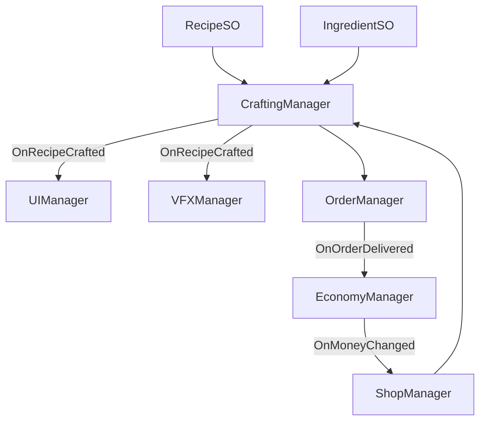

# 📋 GDD — Dukun Chain Reaction (IFEST 2026)

> GDD dibuat mengikuti [[Format Game Design]] — fokus ke tema Chain Reaction + persona Achiever & Explorer.

---

## 🎮 1. Konsep & Identitas Game

- **Premis**: *Game ini adalah Crafting Puzzle-Shop Management di mana pemain sebagai **Dukun Urban** meracik ramuan/sesajen dengan urutan bahan yang memicu reaksi berantai untuk memenuhi pesanan customer demi uang dan membuka resep rahasia.*
- **Genre**: Crafting Puzzle + Time Management (ala Overcooked / Potion Craft)
- **Target Platform**: PC / WebGL (Game Jam build)
- **USP (Unique Selling Point)**:
  1. **Chain Reaction Berurutan**: Urutan bahan = trigger reaksi berantai (A -> B -> C). Bukan sekedar combine bebas. Salah urutan = efek gagal lucu/mistis.
  2. **Dukun Nusantara Modern**: Tema Nusantara Urban + Profesional Fun — dukun hoodie di ruko modern, mantra neon, sesajen aesthetic kramat tapi fun.
  3. **Dual Persona Loop**: Achiever (Grimoire 100% + Perfect Order) & Explorer (Hidden Recipes + Customer Rahasia).
- **Referensi & Inspirasi**: Potion Craft (crafting), Overcooked (order pressure), Little Alchemy (eksperimen)

**Moodboard (dari screenshot):**
- **Temanya**: Nusantara, Modern, Urban
- **Keyword**: Kramat, Mantra, Dukun, Sesajen, Ramuan
- **Vibes**: Modern, Misterius, Fun, Mistis, Profesional, Joy

---

## 🔄 2. Core Gameplay Loop

**Loop Utama:**

```
[Shop: Beli Bahan] -> [Combine: Susun 3-5 Bahan Urut di Meja Ritual] -> [Chain Reaction VFX] -> [Order Check] -> [Output Item] -> [Deliver ke Customer -> +Money + Reputasi] -> Kembali ke Shop
```

- **Core Mechanic**: **Sequential Chain Crafting**. Player drag 3-5 bahan ke slot berurutan. Sistem cek `SequenceEqual` dengan Recipe SSOT. Tiap slot benar memicu VFX rantai (api sesajen menjalar). Contoh output di coretan: `Sepatu Roda` dari kombinasi tertentu.
- **Daya Tarik Jangka Pendek (5 menit)**: Feedback instan - reaksi berantai visual + suara mantra, kepuasan *ting-ting-ting-JADI!* saat urutan benar.
- **Daya Tarik Jangka Panjang (selama jam)**: Achiever: kejar Grimoire lengkap & bintang 3 per order. Explorer: coba semua kombinasi aneh untuk buka item secret.

**Objective Layer:**
- Money = beli bahan (burn rate)
- Reputasi/Bintang = unlock customer sulit + recipe tier 2

---

## ⚔️ 3. Mekanik Utama

Maksimal 3-5 mekanik (Game Jam scope):

- **Mekanik 1 — Sequential Combine (Chain Reaction)**: 5 slot ritual (prototype mulai 3 slot). Player susun bahan. Validasi urutan strict. Benar = output item, Salah = item sampah/fail VFX.
- **Mekanik 2 — Order System**: Customer datang dengan request item spesifik + timer. Deliver benar = Money + rating. Deliver salah/telat = penalty reputasi.
- **Mekanik 3 — Shop & Economy**: Money dipakai beli bahan habis pakai. Bahan tier 1 murah, tier 2 mahal. Loop ekonomi tertutup sederhana untuk balancing jam.
- **Mekanik 4 — Grimoire & Discovery (Explorer Hook)**: Buku mantra yang auto-catat recipe yang sudah ditemukan (Achiever 100%). Ada halaman `???` untuk hidden recipes yang hanya kebuka lewat eksperimen bebas tanpa order.
- **Mekanik 5 — Fail Reaction (Juice)**: Jika urutan salah, bukan cuma popup gagal, tapi spawn efek chain gagal (misal: sesajen meledak jadi asap lucu + suara dukun "waduh").

---

## 💻 4. Arsitektur Data & Design Pattern

- **Design Pattern Pilihan**:
  - **SSOT ScriptableObject**: `IngredientSO`, `RecipeSO` (List<IngredientSO> sequence + ItemSO output), `CustomerOrderSO`.
  - **Observer / Event Channel**: `OnRecipeCrafted`, `OnOrderDelivered`, `OnMoneyChanged` biar UI, VFX, Economy tidak coupled.
  - **Factory Pattern**: `ItemFactory` untuk spawn ItemSO jadi GameObject / icon di output slot.
  - **State Pattern (Enum FSM)**: `GameState { Shop, Ritual, Deliver }` pakai [[Simple FSM Berbasis Enum (Game State Prototyping)]]

- **Arsitektur & Penyimpanan Data**:
  - Semua data resep di ScriptableObject (SSOT).
  - Save sederhana: JSON untuk Grimoire unlock & Money (opsional jam).

- **Mermaid Diagram**:



---

## 🏛️ 5. Desain FTUE (First-Time User Experience)

- **Pendekatan FTUE**: **Contextual UI Hint + Kishōtenketsu mini**:
  1.  **Ki (Intro)**: Customer pertama order 2 bahan saja (tutorial drag & drop). VFX chain ditunjukkan pelan.
  2.  **Sho (Develop)**: Order 3 bahan, pemain belajar urutan penting.
  3.  **Ten (Twist)**: Diberi bahan ngaco, pemain lihat Fail Reaction, diajarin eksperimen = tidak dihukum berat.
  4.  **Ketsu (Master)**: Bebas, timer lebih ketat, Grimoire hint muncul "Coba kombinasi tanpa order?"

---

## 🚀 6. Struktur Folder Modular & Optimisasi Performa

- **Struktur Folder (Feature-Based)**:
```
Assets/_Project/IFEST/
├── 01_Crafting/ (IngredientSO, RecipeSO, CraftingManager, Slots)
├── 02_Order/ (Customer, OrderManager, OrderUI)
├── 03_Economy/ (Money, Shop, Grimoire)
├── 04_VFX_Audio/ (ChainReaction VFX, Mantra SFX)
└── 05_Core/ (GameManager FSM, EventChannels)
```
  - Pakai `.asmdef` per folder biar compile cepat.

- **Rencana Optimisasi**:
  - *CPU/Memori*: Object Pooling untuk customer & VFX asap/mantra.
  - *Rendering/UI*: Canvas Splitting (UI Ritual statis vs Order timer dinamis).

---

## 📏 7. Scope & Feasibility

- **Estimasi Durasi**: Game Jam IFEST (3-7 hari). Prototype 1 hari, MVP 2 hari, Polish 1-2 hari.
- **Ukuran Tim**: Team IFEST (2-4 orang).
- **Risiko Teknis**: Validasi urutan + drag&drop harus solid hari pertama. Solusi: pakai `SequenceEqual` sederhana, jangan bikin sistem fisika.
- **Risiko Desain**: Chain Reaction terasa kayak "tebak resep" membosankan. Validasi: playtest internal tiap tambah 5 recipe, pastikan fail feedback fun.
- **Kriteria "Go/No-Go"**: Jika dalam 1 hari prototype 3-slot + 5 recipe + 1 customer flow sudah fun dengan VFX chain, lanjut polish. Jika masih bingung, cut ke 3 recipe saja.

---

## 📸 Referensi Screenshot

- Moodboard: `Temanya (Nusantara Modern Urban) + Keyword (Kramat Mantra Dukun Sesajen Ramuan) + Vibes (Modern Misterius Fun Mistis Profesional Joy)`
- Coreloop: `Dukun -> Combine (5 slot) -> Order -> Output (contoh: Sepatu Roda) -> Objective (Money) -> Shop -> loop`
