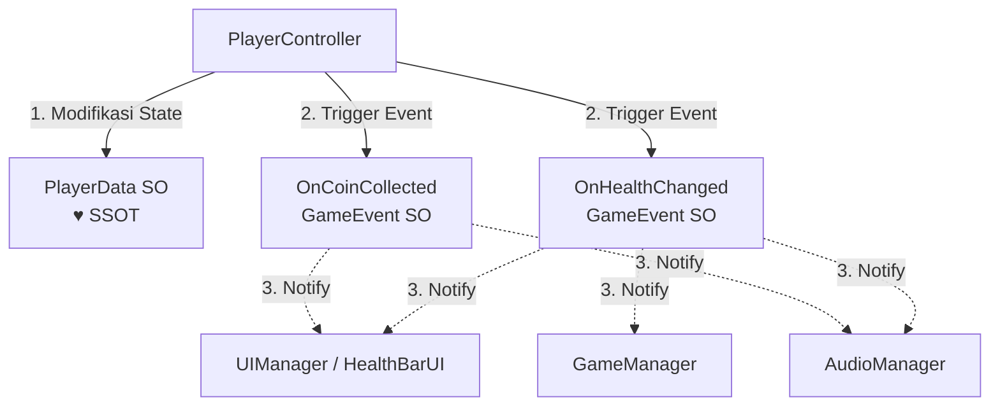

# 📐 Blueprints & Architecture: Project Aegis (2D Action-Platformer Roguelite)

Dokumen ini berisi cetak biru arsitektur data dan desain game komersial skala kecil/menengah untuk solo developer. Game yang dirancang adalah **2D Action-Platformer Roguelite** dengan fokus pada performa tinggi, modularitas, dan retensi pemain yang kuat.

---

## 💻 1. Arsitektur Data (SSOT & Decoupling)

Untuk mencegah bug sinkronisasi data (seperti HP bocor, UI lambat *update*, atau efek suara terpicu ganda), game ini menggunakan prinsip **Single Source of Truth (SSOT)** berbasis **ScriptableObject-based Architecture** yang didekopel menggunakan **Event/Signals Pattern**.

### 🔄 Alur Komunikasi Event-Driven (Decoupled)



> [!NOTE]
> **Mengapa cara ini aman untuk Solo Dev?**
> `PlayerController` tidak tahu kalau `UIManager` atau `AudioManager` ada di scene. Jika UI atau Audio rusak, gameplay loop tetap berjalan tanpa melempar *NullReferenceException*.

### 🛠️ Implementasi Kode C# (Unity)

#### A. Event System Berbasis ScriptableObject (`GameEvent.cs`)
File: `Assets/Scripts/Core/Events/GameEvent.cs`
```csharp
using System.Collections.Generic;
using UnityEngine;

[CreateAssetMenu(fileName = "NewGameEvent", menuName = "Events/Game Event")]
public class GameEvent : ScriptableObject
{
    private readonly List<GameEventListener> listeners = new List<GameEventListener>();

    public void Raise()
    {
        for (int i = listeners.Count - 1; i >= 0; i--)
        {
            listeners[i].OnEventRaised();
        }
    }

    public void RegisterListener(GameEventListener listener) => listeners.Add(listener);
    public void UnregisterListener(GameEventListener listener) => listeners.Remove(listener);
}
```

#### B. Single Source of Truth (`PlayerDataSO.cs`)
File: `Assets/Scripts/Core/Data/PlayerDataSO.cs`
```csharp
using UnityEngine;

[CreateAssetMenu(fileName = "NewPlayerData", menuName = "Data/Player Data")]
public class PlayerDataSO : ScriptableObject
{
    [Header("Current Runtime State")]
    public int currentHealth;
    public int maxHealth;
    public int coins;

    [Header("Events to Trigger")]
    [SerializeField] private GameEvent onHealthChanged;
    [SerializeField] private GameEvent onCoinCollected;

    public void ResetState()
    {
        currentHealth = maxHealth;
        coins = 0;
    }

    public void Damage(int amount)
    {
        currentHealth = Mathf.Max(0, currentHealth - amount);
        onHealthChanged?.Raise();
    }

    public void AddCoins(int amount)
    {
        coins += amount;
        onCoinCollected?.Raise();
    }
}
```

#### C. Penggunaan pada Komponen UI (`HealthBarUI.cs`)
File: `Assets/Scripts/Features/UI/HealthBarUI.cs`
```csharp
using UnityEngine;
using UnityEngine.UI;

public class HealthBarUI : MonoBehaviour
{
    [SerializeField] private PlayerDataSO playerData;
    [SerializeField] private Slider healthSlider;

    private void OnEnable()
    {
        UpdateUI();
    }

    public void UpdateUI()
    {
        if (playerData != null && healthSlider != null)
        {
            healthSlider.maxValue = playerData.maxHealth;
            healthSlider.value = playerData.currentHealth;
        }
    }
}
```

---

## 🏛️ 2. Desain FTUE (First-Time User Experience) - Kishōtenketsu

Untuk mengajarkan mekanik dasar **"Dash (Menghindar)"** secara intuitif tanpa menyuapi pemain dengan *pop-up* teks panjang, kita merancang level tutorial menggunakan metode **Kishōtenketsu (4 Langkah)**.

```mermaid
rect rgb(20, 20, 30)
    note right of Ki: KI (Pengenalan) - Aman, Tanpa Resiko
    note right of Sho: SHŌ (Pengembangan) - Variasi & Resiko Rendah
    note right of Ten: TEN (Twist) - Bahaya & Tekanan Waktu
    note right of Ketsu: KETSU (Resolusi) - Pembuktian & Hadiah
end
```

### 🗺️ Rancangan Layout Level 1-1

```
[Mulai] --> [ Zona KI: Lorong Buntu ] --(Lompat/Dash)--> [ Zona SHŌ: Rintangan Duri ] 
                                                                    │
[Exit] <-- [ Hadiah / Portal ] <-- [ Zona KETSU: Laser Bergerak ] <--┘
```

### 📋 Detail Implementasi Kishōtenketsu:

1. **Ki (起 - Pengenalan)**
   - **Tantangan**: Pemain mulai di sebuah lorong sempit. Di depan ada tembok runtuh yang menghalangi jalan. Satu-satunya celah adalah lubang kecil di bawah reruntuhan setinggi lutut.
   - **Desain**: Tidak ada musuh atau duri. Pemain aman berlama-lama. Jika pemain diam 5 detik, muncul ikon tombol *Dash* tipis (misal: "Shift" atau "Circle/B") di dinding background gua (Just-in-Time visual cue).
   - **Pelajaran**: Pemain belajar menekan tombol *Dash* untuk melewati celah sempit.

2. **Shō (承 - Pengembangan)**
   - **Tantangan**: Setelah melewati celah, pemain menemui celah vertikal yang lebar dengan genangan duri di bawahnya. 
   - **Desain**: Duri ini tidak langsung mematikan, melainkan hanya mengurangi HP sedikit dan me-respawn pemain ke pinggir tebing (tidak merusak flow). Lebar celah membutuhkan kombinasi *Lompat + Dash* di udara.
   - **Pelajaran**: Pemain belajar menggabungkan *Dash* dengan momentum lompatan dan memahami jarak tempuh maksimum *Dash*.

3. **Ten (転 - Kejutan/Twist)**
   - **Tantangan**: Pemain masuk ke ruang terbuka di mana ada jebakan batu yang jatuh secara periodik dari langit-langit (setiap 2 detik sekali).
   - **Desain**: Pemain harus melakukan *Dash* dengan *timing* yang pas tepat saat batu berada di posisi paling atas untuk menyeberang dengan aman. Jika berjalan biasa, mereka pasti terkena batu.
   - **Pelajaran**: Pemain belajar menggunakan *Dash* untuk menghindari objek bergerak dengan memanfaatkan *Invincibility Frames (i-frames)*.

4. **Ketsu (結 - Resolusi)**
   - **Tantangan**: Gerbang keluar terkunci. Di depannya ada laser sensor merah yang bergerak naik turun secara cepat. Di seberang laser terdapat tombol tekanan lantai (*pressure plate*) untuk membuka pintu.
   - **Desain**: Pemain harus melakukan *Dash* menembus laser saat laser bergerak naik, menekan tombol, dan segera meluncur melewati pintu yang perlahan menutup.
   - **Pelajaran & Hadiah**: Pemain membuktikan penguasaan mekanik *Dash*. Begitu pintu terbuka, peti harta karun pertama (senjata/upgrade pertama) menunggu sebagai *hook* retensi 5 menit pertama.

---

## 🚀 3. Struktur Folder Modular & Optimisasi Performa

### 📁 Struktur Folder Berbasis Fitur (Unity)
Struktur ini memastikan kode tetap bersih, mudah di-navigasi, dan didukung oleh **Assembly Definitions (`.asmdef`)** untuk mempercepat waktu kompilasi (*compile time*).

```
Assets/
├── 📂 Art/                    # Aset Visual (Sprites, Textures, Shaders)
├── 📂 Audio/                  # FL Studio exports (SFX, BGM)
├── 📂 Settings/               # URP Asset, Input Action map
└── 📂 ProjectAegis/           # Root utama kode game
    ├── 📂 Core/               # Sistem global dasar
    │   ├── 📄 Core.asmdef
    │   ├── 📂 Data/           # ScriptableObject Data (PlayerDataSO)
    │   ├── 📂 Events/         # GameEvent system
    │   └── 📂 Systems/        # GameManager, SaveSystem, SceneLoader
    │
    └── 📂 Features/           # Fitur gameplay (Bisa dihapus/tambah tanpa merusak Core)
        ├── 📂 Player/
        │   ├── 📄 Player.asmdef (Mereferensikan Core.asmdef)
        │   ├── 📄 PlayerController.cs
        │   └── 📄 CharacterVisuals.cs
        │
        ├── 📂 Enemies/
        │   ├── 📄 Enemies.asmdef
        │   ├── 📄 EnemyAI.cs
        │   └── 📄 EnemyStatsSO.cs
        │
        └── 📂 UI/
            ├── 📄 UI.asmdef
            ├── 📄 HealthBarUI.cs
            └── 📄 MainMenuController.cs
```

### ⚡ Strategi Optimisasi untuk Solo Dev

1. **Object Pooling untuk Efisiensi CPU**
   - **Kasus**: Spawning proyektil, partikel darah, dan teks angka damage (*damage pop-ups*) secara konstan memicu *Garbage Collector (GC)* dan menurunkan FPS.
   - **Solusi**: Gunakan class bawaan Unity `UnityEngine.Pool.ObjectPool<T>` untuk menggunakan kembali object yang sudah mati alih-alih melakukan `Instantiate` dan `Destroy`.

2. **Gunakan ScriptableObject untuk Stat Musuh**
   - Jangan simpan variabel `maxHp`, `moveSpeed`, dan `damage` langsung di script `EnemyAI` monobehaviour.
   - Simpan stat tersebut di `EnemyStatsSO` (ScriptableObject). Jika ada 100 musuh yang sama di layar, mereka semua hanya membaca dari satu file memory yang sama, bukan menduplikasi data 100 kali.

3. **Optimisasi UI (Canvas Splitting)**
   - **Kasus**: Mengubah isi teks/slider HP memicu Unity untuk menggambar ulang (*rebuild*) seluruh elemen UI di Canvas tersebut.
   - **Solusi**: Pisahkan Canvas menjadi 3 bagian:
     - `StaticCanvas`: Untuk background, bingkai UI, dan ikon statis.
     - `DynamicCanvas`: Untuk bar darah, teks cooldown, dan kursor.
     - `OverlayCanvas`: Untuk menu pause atau pop-up item.
