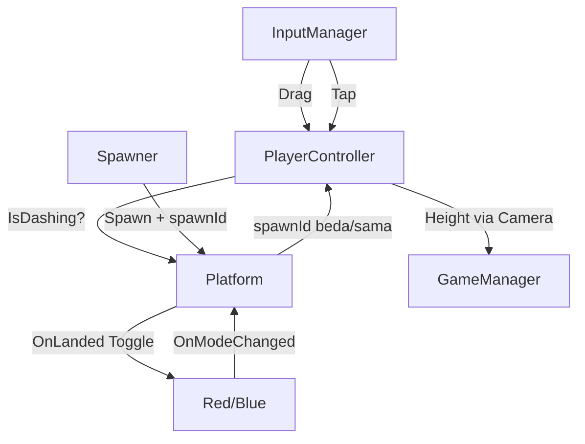

# 💻 TDD - Pair Jump (Technical Design Document)

> *Sumber kebenaran teknis per 12 Sep 2026 — dibaca langsung dari engine via MCP Unity (port 7891), bukan tebakan. Hub: [[Pair Jump]] | GDD: [[GDD - Pair Jump]]*
> *Project: `C:/Users/Paganisium/Documents/Projects/Unity/Gamejam Internal GT 2026` | Unity `6000.6.0f1` | Scene: `SampleScene`*

---

## 1. Ringkasan Teknis

| Item | Detail aktual |
|------|---------------|
| **Engine** | Unity 6 (6000.6.0f1), URP, Android platform, IL2CPP, Linear |
| **Orientasi** | Portrait 1080x1920, 60fps lock (`Application.targetFrameRate=60` di `GameManager.Awake`) |
| **Input** | Input System only (Legacy throw). Drag gerak + tap dash (Plan B). Multi-touch: 1 jari drag + 1 jari tap. Tap = cepat ≤0.25s + geser ≤20px (skala DPI ~0.12"), mulai di atas UI diabaikan |
| **Fisika** | 1x `Rigidbody2D` Dynamic (Player) + `BoxCollider2D` trigger (Platform). No alloc di Update |
| **Scene stat** | 46 GameObject, 150 component. Top: RectTransform 36, Text 20, Image 12, Button 8, Canvas 4 |
| **Script** | 11 file di `Assets/_PairJump/` (12 dengan `Welcome2DScript.cs` template yang tidak dipakai). Post anim: PlayerController 306, PairJumpInput 184, Platform 105, Spawner 189 baris |
| **Prefab** | `Assets/_PairJump/Prefab/Platform.prefab` — ter-wire di `Spawner.platformPrefab`, spawn via Instantiate + fallback kotak prosedural |
| **Animasi** | `Platform sheet_0.controller` — state `Solid` ↔ `Platform Not Solid`, param bool `isSolid`, klip loop 3 frame (swap sprite saja, tint dari kode) |

Struktur folder sesuai GDD §6:
```
Assets/_PairJump/
├── Art/ Animation/ Platform sheet_0.controller, Platform Solid.anim, Platform Not Solid.anim
├── Core/ GameManager.cs, GameState.cs, PairJumpInput.cs, Spawner.cs, CameraFollow.cs, FtueHints.cs
├── Player/ PlayerController.cs, PlayerMode.cs
├── Platform/ Platform.cs
├── Prefab/ Platform.prefab
└── UI/ UIManager.cs, SafeAreaPad.cs
```

## 2. Scene Hierarchy (aktual dari `unity_scene_hierarchy`)

```
Main Camera (Camera, AudioListener, CameraFollow, target=Player)
├── Background (SpriteRenderer)
Global Light 2D
InputManager (PairJumpInput)
Player (Rigidbody2D, CircleCollider2D, SpriteRenderer, PlayerController) pos (0,1,0)
Spawner (Spawner, player=Player)
GameManager (GameManager)
EventSystem (EventSystem + InputSystemUIInputModule)
UIManager (UIManager, wiring lengkap — lihat §7)
StaticCanvas (kosong, reserved Day 3)
DynamicCanvas (HUD saat Play)
├── HeightText + LiveBestText + StreakText (masing-masing + SafeAreaPad)
OverlayCanvas [selalu aktif — jangkar wiring tombol]
├── MainMenuPanel → Title, Subtitle, MenuBest, PlayButton, MuteButton, Howto
├── PausePanel (inactive) → Resume, PauseRestart, PauseMenu
├── GameOverPanel (inactive) → FinalHeight, NewBest (inactive), FinalBest, Retry, GOMenu
└── PauseButton (inactive saat menu, + SafeAreaPad)
WorldspaceCanvas → GameOverPanel (duplikat nganggur, kandidat hapus Day 3)
FtueHints (FtueHints, bikin 3 hint world-space saat runtime)
```

---

## 3. Spesifikasi Tiap Script

### 3.1 `Core/GameState.cs` — 12 baris
Enum FSM sederhana (skill: Simple FSM Berbasis Enum):
`MainMenu, Playing, Paused, GameOver`. Jangan tambah state baru tanpa butuh.

### 3.2 `Core/GameManager.cs` — 96 baris, Singleton SSOT
- `Instance`, `CurrentState`, `BestHeight`, `CurrentHeight`, `IsNewBest`
- `static event Action<GameState> OnStateChanged` — semua UI/player listen ini, tidak ada polling state.
- `BestKey = "pairjump_best"`, load di `Awake`, save **hanya** saat `GameOver` + `PlayerPrefs.Save()` (aman Android/WebGL).
- `UpdateState()`: satu-satunya yang boleh set `Time.timeScale` (0 saat Paused/GameOver, 1 lainnya). Aturan tetap anti bug retry-beku.
- `SubmitHeight(h)`: update Current + Best + flag NewBest. Dipanggil tiap frame dari `UIManager.Update` + sekali dari `CameraFollow` saat mati.
- `static bootPlaying`: survive reload. `Retry()` → boot Playing, `ToMenu()` → boot MainMenu. Keduanya `LoadScene(buildIndex)`.

### 3.3 `Player/PlayerMode.cs` — 2 baris
`enum PlayerMode { Red, Blue }`. Hijau bukan mode, cuma warna platform netral.

### 3.4 `Player/PlayerController.cs` — 306 baris, inti gameplay
Tuning aktual dari engine (bukan default code):
- `normalGravity=3`, `dashGravityMult=3.5`, `hangTime=0.85`, `moveSensitivity=1.2`, `dashCooldown=0.15`, `debugAutoDragPxPerFrame=0`
- Plan B: `dashSlamVelocity=-2`, `dashTimeout=3`. Plan A: `landDebounce=0.1`
- `jumpVelocity = hang * g / 2` dengan `g=9.81*3` → ~12.5. Bounce pertahankan `x*0.3`.
- Setup `Awake`: `freezeRotation`, `sleepMode=NeverSleep`, `Continuous`, `WakeUp()`. **Jangan diubah** — ini fix bug Day 1 bola beku di apex.
- Event: `OnModeChanged(PlayerMode)`, `OnDashChanged(bool)`, `OnStreakChanged(int)`.
- `Start` + `HandleGameState`: hold total saat bukan Playing (`velocity=0 + gravityScale=0`). Masuk Playing: resume `savedVel` kalau >0.5 (canDash dipertahankan apa adanya — pause strict, tidak kasih dash gratis) else luncur `jumpVelocity` + `canDash=true`. Keluar Playing: simpan `savedVel`, clear `IsDashing`, buang `pendingDragPx` (anti teleport pas resume). Plan A: `GameOver`/`MainMenu` → `ResetStreak()` (streak 0 + lupa platform terakhir); `Paused` sengaja TIDAK reset.
- Input: `HandleDrag` antre ke `pendingDragPx`. `HandleDashRequest` (listen `OnTap`): gate `IsPlaying` + `canDash` (Plan B lock — sekali per lompatan, tap kedua di udara diabaikan) + cooldown → `IsDashing=true`, `gravityScale=3*3.5`, slam-cut: kalau `vy > -2` (naik/jatuh pelan) langsung jadi `(vx*0.5, -2)`; jatuh lebih cepat dipertahankan.
- `FixedUpdate`: konversi px→world via `(2*ortho*aspect)/Screen.width`, sens 1.2 (0.6 saat dash). **Geser X via `transform.position += (dx,0,0)` — JANGAN `MovePosition`** (A/B-tested 11 Sep: MovePosition delta Y=0 berantem dengan `velocity.y` → Y beku). Lalu `Wrap()` kiri-kanan via `halfW = ortho*aspect`.
- `TryLand(Platform p)`: gate `IsPlaying`/null, tolak `velocity.y>0.5` kecuali dashing, tolak jika bola di bawah platform -0.1. `dashActive = IsDashing || (now-dashEnd<0.05 && now-lastDash<0.3)` (coyote). `solid = p.IsSolidFor(mode, dashActive)`, ghost → return. Debounce: `now-lastLand<0.1` → return (anti dobel-hit Enter+Stay, bug Day2 #7). Kalau dash → toggle Red↔Blue + reset gravity + invoke events + `RefreshAllPlatforms()` + `UpdateColor()` (Red `#FF8C8C`-ish `(1,0.55,0.55)`, Blue `(0.45,0.68,1)`). Streak Plan A (lock King): beda platform → +1 (normal maupun dash), sama → 0, identitas via `spawnId` pool-safe (fallback referensi untuk platform tanpa ID). Bounce selalu + `canDash=true` (isi ulang jatah dash).
- `Update`: cancel-on-rise DIHAPUS Plan B (dash boleh mulai saat naik). Safety timeout: `IsDashing` > 3s (miss semua) → stop + gravity normal.

### 3.5 `Core/PairJumpInput.cs` — 184 baris, tap dash
- Event statik: `OnDragDeltaPixels(float dxPx)`, `OnTap`. `OnSwipeDown` DIHAPUS total Plan B (tidak ada subscriber lain — compile bersih membuktikan).
- Tuning: `tapMaxDistPx=20`, `tapMaxTime=0.25`. `Awake`: kalau `Screen.dpi>0` → `maxDist = max(20, dpi*0.12)` (~0.12 inch fisik, fix HP dpi tinggi ala bug #5).
- `IsTap(dt, dist, maxTime, maxDist)` statik murni (dt≥0, dt≤maxTime, dist≤maxDist) — bisa di-unit-test tanpa scene/device. Cek UI di caller, bukan di sini.
- `PointerState` per touchId + `MouseId=-100`. Mouse = desktop, Touchscreen = mobile. Multi-touch: jari 1 drag + jari 2 tap bersamaan.
- `Began`: skip kalau `IsOverUI` (tap di atas tombol tidak dash). `Moved/Stationary`: invoke `dx` kalau >0.01 + tandai `movedFar` kalau jauh dari titik awal > maxDist. `Ended`/mouse-release: kalau `!movedFar` + `IsTap` → `OnTap`. `Canceled` → buang tanpa tap.
- `IsOverUI`: `IsPointerOverGameObject()` / `(fingerId)`, try-catch agar tidak throw.

### 3.6 `Platform/Platform.cs` — 105 baris, animasi solid/ghost
- `enum PlatformColor { Red, Blue, Green }`, `col.isTrigger=true` (dipaksa di `Awake` — prefab menyimpan false).
- Plan A: `spawnId` (-1 = belum di-spawn) + `OnSpawned(id)`. ID monoton naik, tidak di-reuse — streak tetap benar saat pool recycle. Migrasi pool: panggil tiap ambil dari pool, BUKAN tiap Instantiate.
- Visual: `visualRenderer` (bisa di-wire). `Awake` cari otomatis renderer YANG PUNYA SPRITE (child dulu) — wajib karena art prefab (`Platform sheet_0` + Animator, ~2.84×0.66) ada di child, root menyimpan SpriteRenderer kosong.
- Animasi: `platformAnimator` (auto-cari di child) + `IsSolidParam="isSolid"`. `RefreshVisual` → `SetBool(isSolid, solid)` → klip `Solid` ↔ `Platform Not Solid` (loop 3 frame, hanya swap sprite — tint warna tetap dari kode). Controller: 1 layer, param bool default true, transisi tanpa exit-time durasi 0.25 (DIPERBAIKI 12 Sep — transisi bawaan mati, di-rebuild via API; backup rusak di Temp `opencode/Platform sheet_0.controller.bak`).
- Tint: warna identitas platform (Red/Blue/Green) — BUKAN status solid. Alpha SELALU 1 (sprite ghost King sudah pas tanpa fade). Hanya fallback prosedural tanpa Animator yang pakai alpha 0.25.
- `OnTriggerEnter/Stay → TryLand`: delegasi penuh ke Player (platform tidak bounce sendiri).

### 3.7 `Core/Spawner.cs` — 189 baris, prefab + solvable + spawnId
Tuning scene: `prewarm=12`, `gapMinY=1.8`, `gapMaxY=2.4`, `maxGapX=4` (code default 3 — scene menang), `greenBailoutEvery=5`. `player` + `platformPrefab` (Platform.prefab) ter-wire.
- Art pass: `SpawnAt(x, y, color)` → `Instantiate(platformPrefab)` bila di-wire (ukuran + art ikut prefab ~2.84, posisi di-override, nama `Platform_{color}_{y}`); bila kosong → fallback kotak putih prosedural Day 1-2 + warning sekali di `Start`. Safety: prefab tanpa script Platform ditambah manual + warning.
- Plan A: `nextSpawnId` (mulai 1). Tiap spawn → `plat.OnSpawned(nextSpawnId++)`.
- `Start`: lantai hijau + prewarm loop. `Update`: spawn while `nextY < cam.y+ortho` (guard 10/frame), destroy saat `y < cam.y-ortho-6`. Registry `List<Platform> live` — tidak ada `Find` per-frame.
- `SpawnNext`: `gap=Random(1.8,2.4)`, `x=Clamp(lastX±Random(maxGapX), -halfW, halfW)` → `|dX|≤maxGapX` terjaga.
- `PickColor(y)`: `<30 Green only`, `<80 Green/Red 50/50`, `<130 TutorialPattern deterministik 12 langkah` (maks 1 toggle per lompatan), `130+ weighted 35/32/33` + bailout Hijau tiap 5 non-hijau beruntun di zona acak.
- Setiap spawn: `color` + `OnSpawned` + `RefreshVisual(mode saat ini)` → `live.Add`.

### 3.8 `Core/CameraFollow.cs` — 55 baris, naik-only + death
- `target=Player`, `deathBuffer=2.5` (sesuai GDD).
- `highestY` + `startY`, `Height = max(0, highestY-startY)`. `LateUpdate`: kamera `y=highestY` (tidak pernah turun).
- GameOver sekali (`gameOverSent`, reset via reload): jika `target.y < highestY-ortho-deathBuffer` → `SubmitHeight(Height)` + `UpdateState(GameOver)`.

### 3.9 `Core/FtueHints.cs` — 63 baris
Bikin 3 Canvas world-space saat `Awake` (font `LegacyRuntime.ttf`, tanpa Raycaster agar tidak blokir input):
- `HintMove` y=6 `"GESER KIRI-KANAN"`, `HintColor` y=36 `"INJAK YANG SENADA"`, `HintDash` y=86 `"TAP: DASH & GANTI WARNA"` (Plan B, dulu SWIPE BAWAH).
- Teks cara main di `OverlayCanvas/MainMenuPanel/HowtoText` juga diganti ke `TAP: dash & ganti warna` (edit scene, sudah di-save).
- `Update`: visible by `cam.y`: `<28`, `28-78`, `78-128`. Scale 0.005, size 1400x300.

### 3.10 `UI/UIManager.cs` — 179 baris
Referensi sudah ter-wire semua di inspector (MainMenu/Pause/GameOver panel, PauseButton, 8 Text).
- `OnEnable`: subscribe `OnStateChanged` + `OnStreakChanged` + `WireButtons()`. **Wiring wajib di OnEnable, bukan builder** — listener runtime tidak tersimpan di scene file (penyebab PlayButton mati Day 2).
- `WireButtons`: cari `OverlayCanvas` (selalu aktif) → `GetComponentsInChildren<Button>(true)` → switch nama (Play/Pause/Resume/PauseRestart/PauseMenu/Retry/GOMenu/Mute). `Find` per tombol dilarang — buta terhadap inactive. `Rewire` = remove-then-add (idempoten).
- `Update`: hanya saat Playing → `SubmitHeight(camFollow.Height)` + `heightText "Nm"` + `liveBest "Best: Nm"`.
- `HandleStreak`: `"xN COMBO!"` atau kosong. `HandleState`: show/hide 4 elemen + isi GameOver (final/best/NewBest jika `IsNewBest && h>0.5`) + MainMenu best.
- Tombol: Play/Resume→Playing, Pause→Paused, Restart→`GameManager.Retry()`, Menu→`ToMenu()`, Mute→toggle `pairjump_mute` + label `SUARA: ON/OFF` (stub — AudioManager Day 3).

### 3.11 `UI/SafeAreaPad.cs` — 43 baris
Geser RectTransform ke dalam `Screen.safeArea` (notch HP), sadar `scaleFactor`, sekali saja (`applied` flag). Terpasang di: PauseButton, HeightText, LiveBestText, StreakText. No-op di editor.

---

## 4. Alur Data & Event

```
Touch/Mouse → PairJumpInput (dx px drag / tap) → PlayerController (queue drag, dash jika canDash)
Platform trigger → PlayerController.TryLand → IsSolidFor? → toggle mode?
  → OnModeChanged → RefreshAllPlatforms + UpdateColor
  → OnDashChanged / OnStreakChanged → UIManager
CameraFollow.Height → UIManager.Update → GameManager.SubmitHeight → Best
CameraFollow jatuh → GameManager.UpdateState(GameOver) → UIManager.HandleState (streak reset)
Tombol → UIManager → GameManager.UpdateState / Retry / ToMenu (reload scene)
```

Mermaid (update Plan B — swipe → tap):


## 5. Pattern & Skill Vault Terkait

- ✅ Simple FSM Enum (`GameState`, `PlayerMode`) — [[Simple FSM Berbasis Enum (Game State Prototyping)]]
- ✅ Centralized State Manager + SSOT (`GameManager` satu-satunya pemilik state/best) — [[Centralized State Manager (GameManager Singleton & Event)]] + [[Single Source of Truth (SSOT)]]
- ✅ Observer (`OnStateChanged`, `OnModeChanged`, `OnDashChanged`, `OnStreakChanged`) — [[Observer Pattern Events]]
- ✅ FTUE zonasi + hint in-world — [[Tutorial Level Building Blocks]] + [[Framework Kihon-Kata-Kumite (Learning Curve & Encounter Design)]]
- ⚠️ Object Pooling **belum**: `Spawner` masih `Destroy` + `new GameObject` + `MakeSquare` cache. GDD minta pool ~20. Tech debt Day 3 kalau GC spike di HP (prioritas rendah untuk jam — alokasi hanya saat spawn, bukan per-frame).

---

## 6. Tech Debt & Risiko Day 3 (dari kode aktual)

1. `maxGapX` scene=4 vs code default 3 — jangan revert via code, ubah di inspector saja. 4 masih reachable dengan sens 1.2 + wrap, tapi uji HP dulu.
2. `WorldspaceCanvas/GameOverPanel` nganggur — hapus atau abaikan biar tidak bingung.
3. `applicationIdentifier` masih `com.DefaultCompany` — ganti sebelum submit (catatan Blok F).
4. Audio: `MuteButton` cuma flag. Butuh `AudioManager` + pool `AudioSource` + 5 SFX + BGM loop ogg (lihat checklist Day 3 di [[Pair Jump]]).
5. Visual sisa: player masih kotak/bulat polos (bulat + mata + squash-stretch next). Platform sudah art prefab + anim. Palette tetap `#FF6B6B/#4D96FF/#7BF59B/#1A1C2C`.
6. Jangan edit code saat Play nyala + selalu `Assets/Refresh` habis edit (aturan tetap Blok F — file watcher skip = assembly basi).
7. Plan B balance: tap (≤0.25s/≤20px DPI-scaled) + slam -2 + 1 dash/lompatan bikin toggle lebih mudah dari swipe — zona tutorial 80-130 observasi ulang, retune bila terlalu gampang. Tes HP: misinput drag-vs-tap + multitouch (drag 1 jari + tap jari lain).
8. Selesai 12 Sep: streak beda/sama + reset GameOver ✅, tap dash + dash saat naik + sekali/lompatan ✅, spawn prefab + tint fix ✅, animasi solid/ghost via `isSolid` ✅ (tes ALL PASS, smoke Play bersih).
9. Temuan audit `Platform.prefab` + controller (semua ditangani, YAML prefab TIDAK diubah): collider `isTrigger=false` di file (dipaksa true oleh `Awake` — fragile tapi jalan); SpriteRenderer kosong di root (komponen mati, harmless); posisi root leftover (selalu di-override spawner); collider 2.75×0.6 ≈ visual 2.84×0.66 (pas). Controller: transisi bawaan MATI (bool tidak mempan, state `Solid` tak bisa dimasuki — kemungkinan artefak Aseprite importer) → di-rebuild via API resmi (IfNot/If, durasi 0.25, tanpa exit-time), verified 2 arah. Kalau King edit ulang transisi di Animator window, tes ulang 2 arah via `SetBool`.

## 7. Verifikasi Kebenaran Dokumen Ini

- Semua path + angka tuning dibaca via `unity_script_read` + `unity_component_get_properties` 12 Sep 2026. Prefab + controller + klip dibaca via YAML langsung.
- Hierarchy via `unity_scene_hierarchy` (46 objek) + `unity_scene_stats`.
- Plan A (streak spawnId + debounce + reset GameOver): tes atomik ALL PASS — beda +1 (normal & dash), sama → 0, debounce tahan dobel-hit, pause pertahankan, GameOver/MainMenu → 0, pool-reuse (ID baru) dihitung beda.
- Plan B (tap + dash naik + 1/lompatan): `IsTap` 5/5 PASS; dash saat naik + slam -2 PASS; tap kedua di udara ditolak PASS; landing isi ulang PASS; pause-resume strict PASS; regresi streak PASS; smoke Play bersih, compile 0 error.
- Prefab (Platform 91→105 + Spawner 189 baris): Play test 13/13 instance dari prefab (spawnId ✅, sprite ✅, Animator ✅, trigger ✅), bola bounce normal. Test litter Plan A dibersihkan + scene di-save.
- Animasi: klip `Solid`/`Not Solid` (loop 3 frame, swap sprite saja — tint warna tetap dari kode). Transisi bawaan controller mati (bool tak mempan, dibuktikan 10+ tes live dua arah + reimport) → rebuild via API resmi → false→Ghost ✅ true→Solid ✅. Jalur kode asli `RefreshVisual`: ghost = anim ghost + tint identitas + alpha 1 ✅, solid balik ✅ (round-trip). Satu sempat salah baca hasil (tint identitas dikira tint status) — terkoreksi via baca rgba langsung.
- Tidak ada tebakan: kalau ragu, cek ulang via MCP sebelum ubah kode.
