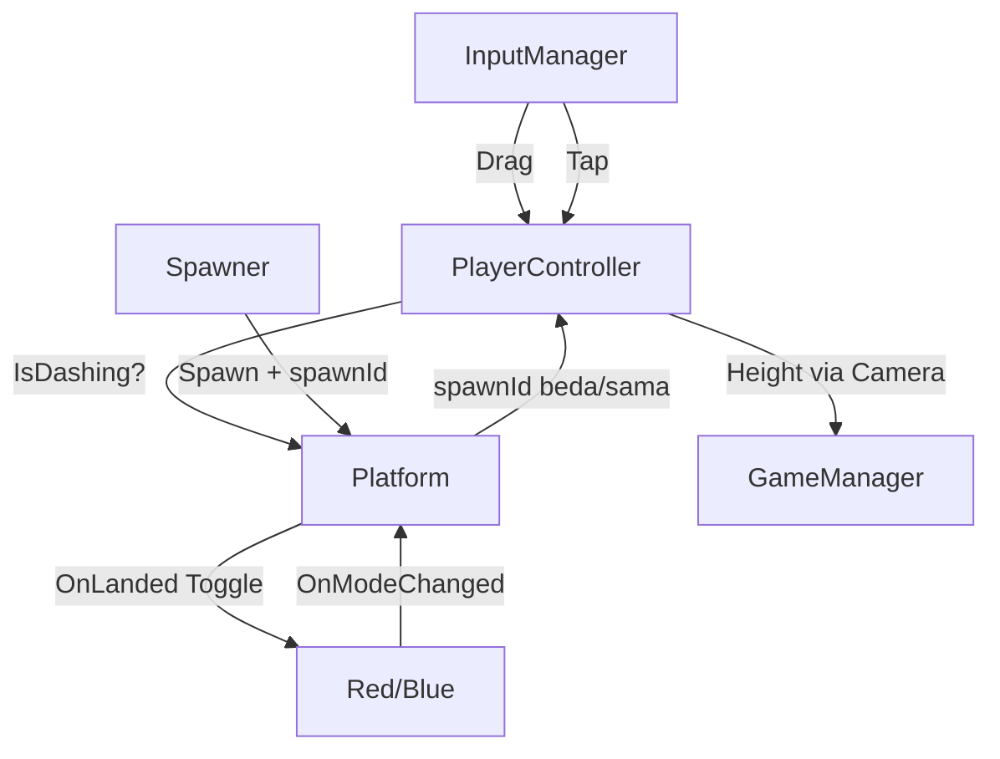

# 💻 TDD - Pair Jump (Technical Design Document)

> *Sumber kebenaran teknis per 12 Sep 2026 — dibaca langsung dari engine via MCP Unity (port 7891), bukan tebakan. Hub: [[Pair Jump]] | GDD: [[GDD - Pair Jump]]*
> *Project: `C:/Users/Paganisium/Documents/Projects/Unity/Gamejam Internal GT 2026` | Unity `6000.6.0f1` | Scene: `SampleScene`*

---

## 1. Ringkasan Teknis

| Item | Detail aktual |
|------|---------------|
| **Engine** | Unity 6 (6000.6.0f1), URP, Android platform, IL2CPP, Linear |
| **Orientasi** | Portrait 1080x1920, 60fps lock (`Application.targetFrameRate=60` di `GameManager.Awake`) |
| **Input** | Input System only (Legacy throw). Drag gerak + tap dash (Plan B). Multi-touch: 1 jari drag + 1 jari tap. Tap = cepat ≤0.25s + geser ≤20px (skala DPI ~0.12"), mulai di atas UI diabaikan |
| **Fisika** | 1x `Rigidbody2D` Dynamic (Player, radius 0.45, damping 0, NeverSleep, Continuous) + `BoxCollider2D` trigger (Platform 2.75×0.6). No alloc di Update |
| **Scene stat** | 46 GameObject, 150 component. Top: RectTransform 36, Text 20, Image 12, Button 8, Canvas 4 |
| **Script** | 11 file di `Assets/_PairJump/` (12 dengan `Welcome2DScript.cs` template yang tidak dipakai). Post apex+tepi: PlayerController 343, PairJumpInput 184, Platform 116, Spawner 219 baris |
| **Prefab** | `Assets/_PairJump/Prefab/Platform.prefab` — ter-wire di `Spawner.platformPrefab`, spawn via Instantiate + fallback kotak prosedural |
| **Animasi** | `Platform sheet_0.controller` — state `Solid` ↔ `Platform Not Solid`, param bool `isSolid`, klip loop 3 frame (swap sprite saja, tint dari kode) |
| **Spawner tuning** | `maxGapX=2.5` (scene, dulu 4), bound refleksi = halfW − 1.375 − 0.2, gap Y 1.8–2.4 vs lompat maks ±2.65 |

Struktur folder sesuai GDD §6:
```
Assets/_PairJump/
├── Art/ Animation/ Platform sheet_0.controller, Platform Solid.anim, Platform Not Solid.anim
├── Core/ GameManager.cs, GameState.cs, PairJumpInput.cs, Spawner.cs, CameraFollow.cs, FtueHints.cs
├── Player/ PlayerController.cs, PlayerMode.cs
├── Platform/ Platform.cs
├── Prefab/ Platform.prefab
└── UI/ UIManager.cs, SafeAreaPad.cs
```

## 2. Scene Hierarchy (aktual dari `unity_scene_hierarchy`)

```
Main Camera (Camera, AudioListener, CameraFollow, target=Player)
├── Background (SpriteRenderer)
Global Light 2D
InputManager (PairJumpInput)
Player (Rigidbody2D, CircleCollider2D, SpriteRenderer, PlayerController) pos (0,1,0)
Spawner (Spawner, player=Player)
GameManager (GameManager)
EventSystem (EventSystem + InputSystemUIInputModule)
UIManager (UIManager, wiring lengkap — lihat §7)
StaticCanvas (kosong, reserved Day 3)
DynamicCanvas (HUD saat Play)
├── HeightText + LiveBestText + StreakText (masing-masing + SafeAreaPad)
OverlayCanvas [selalu aktif — jangkar wiring tombol]
├── MainMenuPanel → Title, Subtitle, MenuBest, PlayButton, MuteButton, Howto
├── PausePanel (inactive) → Resume, PauseRestart, PauseMenu
├── GameOverPanel (inactive) → FinalHeight, NewBest (inactive), FinalBest, Retry, GOMenu
└── PauseButton (inactive saat menu, + SafeAreaPad)
WorldspaceCanvas → GameOverPanel (duplikat nganggur, kandidat hapus Day 3)
FtueHints (FtueHints, bikin 3 hint world-space saat runtime)
```

---

## 3. Spesifikasi Tiap Script

### 3.1 `Core/GameState.cs` — 12 baris
Enum FSM sederhana (skill: Simple FSM Berbasis Enum):
`MainMenu, Playing, Paused, GameOver`. Jangan tambah state baru tanpa butuh.

### 3.2 `Core/GameManager.cs` — 96 baris, Singleton SSOT
- `Instance`, `CurrentState`, `BestHeight`, `CurrentHeight`, `IsNewBest`
- `static event Action<GameState> OnStateChanged` — semua UI/player listen ini, tidak ada polling state.
- `BestKey = "pairjump_best"`, load di `Awake`, save **hanya** saat `GameOver` + `PlayerPrefs.Save()` (aman Android/WebGL).
- `UpdateState()`: satu-satunya yang boleh set `Time.timeScale` (0 saat Paused/GameOver, 1 lainnya). Aturan tetap anti bug retry-beku.
- `SubmitHeight(h)`: update Current + Best + flag NewBest. Dipanggil tiap frame dari `UIManager.Update` + sekali dari `CameraFollow` saat mati.
- `static bootPlaying`: survive reload. `Retry()` → boot Playing, `ToMenu()` → boot MainMenu. Keduanya `LoadScene(buildIndex)`.

### 3.3 `Player/PlayerMode.cs` — 2 baris
`enum PlayerMode { Red, Blue }`. Hijau bukan mode, cuma warna platform netral.

### 3.4 `Player/PlayerController.cs` — 343 baris, apex konsisten
Tuning aktual dari engine (bukan default code):
- `normalGravity=3`, `dashGravityMult=3.5`, `hangTime=0.85`, `moveSensitivity=1.2`, `dashCooldown=0.15`, `debugAutoDragPxPerFrame=0`
- Plan B: `dashSlamVelocity=-2`, `dashTimeout=3`. Plan A: `landDebounce=0.1`. Landing: `landTol=0.1`, `landSnapEps=0.02`
- `jumpVelocity = hang * g / 2` dengan `g=9.81*3` → ~12.5, lompat maks ~2.65. Bounce pertahankan `x*0.3`.
- Setup `Awake`: `freezeRotation`, `sleepMode=NeverSleep`, `Continuous`, `WakeUp()`, `ballRadius` dari CircleCollider (0.45). **Jangan diubah** — ini fix bug Day 1 bola beku di apex.
- Event: `OnModeChanged(PlayerMode)`, `OnDashChanged(bool)`, `OnStreakChanged(int)`.
- `Start` + `HandleGameState`: hold total saat bukan Playing (`velocity=0 + gravityScale=0`). Masuk Playing: resume `savedVel` kalau >0.5 (canDash dipertahankan, strict) else luncur `jumpVelocity` + `canDash=true`; `prevY` sinkron. Keluar Playing: simpan `savedVel`, clear `IsDashing`, buang `pendingDragPx`. Plan A: `GameOver`/`MainMenu` → `ResetStreak()`; `Paused` TIDAK reset.
- Input: `HandleDrag` antre ke `pendingDragPx`. `HandleDashRequest` (listen `OnTap`): gate `IsPlaying` + `canDash` (sekali per lompatan) + cooldown → `IsDashing=true`, `gravityScale=3*3.5`, slam-cut `(vx*0.5, -2)`.
- `FixedUpdate`: konversi px→world, sens 1.2 (0.6 dash). **Geser X via `transform.position` — JANGAN `MovePosition`** (A/B-tested 11 Sep). `Wrap()` + `prevY = rb.position.y` di akhir.
- `TryLand(Platform p)` FIX apex: gate `ShouldLand(prevBottom=prevY−0.45, platTop, vy, dash, tol)` — frame lalu bawah bola harus masih di atas permukaan. Gate center-vs-center lama (`y < p.y−0.1`) dihapus: itu bikin entry diagonal mendarat lebih dalam/bahkan tembus → apex random ±30%. Side-hit dalam tetap tembus (benar). Lalu: solid? → debounce 0.1 → toggle + streak Plan A (beda +1/sama 0) → **snap `y = platTop+0.45+0.02`** → bounce `vy=jumpVelocity` + `canDash=true`. Semua bounce mulai identik → apex identik.
- `ShouldLand(...)` statik murni (unit-testable). `Update`: timeout dash 3s (cancel-on-rise dihapus Plan B).

### 3.5 `Core/PairJumpInput.cs` — 184 baris, tap dash
- Event statik: `OnDragDeltaPixels(float dxPx)`, `OnTap`. `OnSwipeDown` DIHAPUS total Plan B (tidak ada subscriber lain — compile bersih membuktikan).
- Tuning: `tapMaxDistPx=20`, `tapMaxTime=0.25`. `Awake`: kalau `Screen.dpi>0` → `maxDist = max(20, dpi*0.12)` (~0.12 inch fisik, fix HP dpi tinggi ala bug #5).
- `IsTap(dt, dist, maxTime, maxDist)` statik murni (dt≥0, dt≤maxTime, dist≤maxDist) — bisa di-unit-test tanpa scene/device. Cek UI di caller, bukan di sini.
- `PointerState` per touchId + `MouseId=-100`. Mouse = desktop, Touchscreen = mobile. Multi-touch: jari 1 drag + jari 2 tap bersamaan.
- `Began`: skip kalau `IsOverUI` (tap di atas tombol tidak dash). `Moved/Stationary`: invoke `dx` kalau >0.01 + tandai `movedFar` kalau jauh dari titik awal > maxDist. `Ended`/mouse-release: kalau `!movedFar` + `IsTap` → `OnTap`. `Canceled` → buang tanpa tap.
- `IsOverUI`: `IsPointerOverGameObject()` / `(fingerId)`, try-catch agar tidak throw.

### 3.6 `Platform/Platform.cs` — 116 baris, TopY + animasi
- `enum PlatformColor { Red, Blue, Green }`, `col.isTrigger=true` (dipaksa di `Awake` — prefab menyimpan false).
- Plan A: `spawnId` + `OnSpawned(id)`, monoton, tidak di-reuse. Migrasi pool: panggil tiap ambil dari pool.
- `TopY` = `y + halfHeightWorld` (`col.size.y/2 × lossyScale.y`, prefab 0.3) — permukaan dunia tahan ganti art, dipakai gate top-crossing (FIX apex).
- Visual: `visualRenderer` (auto: yang punya sprite, child dulu). Animasi: `platformAnimator` (auto child) + `SetBool("isSolid", solid)` → klip `Solid` ↔ `Platform Not Solid` (loop 3 frame, swap sprite saja). Controller di-rebuild via API (transisi bawaan mati).
- Tint: warna identitas platform, alpha SELALU 1 (sprite ghost pas tanpa fade). Hanya fallback prosedural tanpa Animator yang pakai alpha 0.25.
- `OnTriggerEnter/Stay → TryLand`: delegasi penuh ke Player.

### 3.7 `Core/Spawner.cs` — 219 baris, refleksi tepi
Tuning scene: `prewarm=12`, `gapMinY=1.8`, `gapMaxY=2.4`, **`maxGapX=2.5`** (dulu 4 — scene + code disamakan), `greenBailoutEvery=5`, `edgeMargin=0.2`. `player` + `platformPrefab` ter-wire.
- FIX tepi: `bound = max(1, halfW − halfWidth − margin)` (≈±1.9 di layar 9:16 — platform selalu full on-screen, dulu nongol 0.4). `halfWidth` dibaca dari collider prefab (1.375, tahan ganti art). `ReflectX(lastX, roll, bound)` pantul balik (bukan clamp yang 50% nempel + slam tiap ~8 spawn). Monte Carlo 500: edge-hit 0.6%, max run 1.
- Art: `SpawnAt(x, y, color)` → Instantiate prefab (ukuran ikut art) atau fallback kotak + warning. Safety tambah-script + warning bila prefab lupa Platform.
- Plan A: `nextSpawnId` → `OnSpawned` tiap spawn.
- `Start`: lantai hijau + prewarm. `Update`: spawn guard 10/frame, destroy bawah kamera. Registry `live` sendiri.
- `PickColor(y)`: `<30` hijau, `<80` hijau/merah 50/50, `<130` pola tutorial deterministik 12 langkah, `130+` 35/32/33 + bailout tiap 5 non-hijau. Zona/tutor TIDAK berubah oleh fix tepi.
- Setiap spawn: `color` + `OnSpawned` + `RefreshVisual(mode)` → `live.Add`.

### 3.8 `Core/CameraFollow.cs` — 55 baris, naik-only + death
- `target=Player`, `deathBuffer=2.5` (sesuai GDD).
- `highestY` + `startY`, `Height = max(0, highestY-startY)`. `LateUpdate`: kamera `y=highestY` (tidak pernah turun).
- GameOver sekali (`gameOverSent`, reset via reload): jika `target.y < highestY-ortho-deathBuffer` → `SubmitHeight(Height)` + `UpdateState(GameOver)`.

### 3.9 `Core/FtueHints.cs` — 63 baris
Bikin 3 Canvas world-space saat `Awake` (font `LegacyRuntime.ttf`, tanpa Raycaster agar tidak blokir input):
- `HintMove` y=6 `"GESER KIRI-KANAN"`, `HintColor` y=36 `"INJAK YANG SENADA"`, `HintDash` y=86 `"TAP: DASH & GANTI WARNA"` (Plan B, dulu SWIPE BAWAH).
- Teks cara main di `OverlayCanvas/MainMenuPanel/HowtoText` juga diganti ke `TAP: dash & ganti warna` (edit scene, sudah di-save).
- `Update`: visible by `cam.y`: `<28`, `28-78`, `78-128`. Scale 0.005, size 1400x300.

### 3.10 `UI/UIManager.cs` — 179 baris
Referensi sudah ter-wire semua di inspector (MainMenu/Pause/GameOver panel, PauseButton, 8 Text).
- `OnEnable`: subscribe `OnStateChanged` + `OnStreakChanged` + `WireButtons()`. **Wiring wajib di OnEnable, bukan builder** — listener runtime tidak tersimpan di scene file (penyebab PlayButton mati Day 2).
- `WireButtons`: cari `OverlayCanvas` (selalu aktif) → `GetComponentsInChildren<Button>(true)` → switch nama (Play/Pause/Resume/PauseRestart/PauseMenu/Retry/GOMenu/Mute). `Find` per tombol dilarang — buta terhadap inactive. `Rewire` = remove-then-add (idempoten).
- `Update`: hanya saat Playing → `SubmitHeight(camFollow.Height)` + `heightText "Nm"` + `liveBest "Best: Nm"`.
- `HandleStreak`: `"xN COMBO!"` atau kosong. `HandleState`: show/hide 4 elemen + isi GameOver (final/best/NewBest jika `IsNewBest && h>0.5`) + MainMenu best.
- Tombol: Play/Resume→Playing, Pause→Paused, Restart→`GameManager.Retry()`, Menu→`ToMenu()`, Mute→toggle `pairjump_mute` + label `SUARA: ON/OFF` (stub — AudioManager Day 3).

### 3.11 `UI/SafeAreaPad.cs` — 120 baris, anchor-aware
Notch/punch-hole handler, anchor-aware (fix bug simulator 12 Sep).
- Bug lama: inset diterapkan ke `offsetMin` SEKALIGUS `offsetMax` di semua sumbu. Keempat HUD (Height/LiveBest/Streak/PauseButton) anchor-nya single-point (min==max) → size dimakan dua sisi sampai INVERSI. Bukti: LiveBest 800×70 di Punch Hole Left jadi height −53.19 (`70−2×61.6=−53.2` ✅ persis) + posY −210.6→−272. PauseButton (lebar 166.6, anchor kanan-atas) punya bug laten sama dari inset kiri — ketutup karena inactive di MainMenu.
- Aturan baru `ComputePad` murni (static, unit-testable): sumbu stretch (0..1) → pad offset + clamp; sumbu single-point → size UTUH, `anchoredPosition` digeser menjauhi tepi (top→turun, dst.); center diam; partial → hanya sisi nempel tepi. Clamp + warning bila inset melebihi ruang (tak pernah inversi). Idempoten + no-op bila inset nol. Portrait-lock: rotate diabaikan.
- Unit test 6/6 PASS (replay angka bug: size 800×70 utuh, maxY −237.2). Terpasang di: PauseButton, HeightText, LiveBestText, StreakText. Verifikasi visual simulator oleh King (MCP tak bisa buka Device Simulator).

## 4. Alur Data & Event

```
Touch/Mouse → PairJumpInput (dx px drag / tap) → PlayerController (queue drag, dash jika canDash)
Platform trigger → PlayerController.TryLand → IsSolidFor? → toggle mode?
  → OnModeChanged → RefreshAllPlatforms + UpdateColor
  → OnDashChanged / OnStreakChanged → UIManager
CameraFollow.Height → UIManager.Update → GameManager.SubmitHeight → Best
CameraFollow jatuh → GameManager.UpdateState(GameOver) → UIManager.HandleState (streak reset)
Tombol → UIManager → GameManager.UpdateState / Retry / ToMenu (reload scene)
```

Mermaid (update Plan B — swipe → tap):


## 5. Pattern & Skill Vault Terkait

- ✅ Simple FSM Enum (`GameState`, `PlayerMode`) — [[Simple FSM Berbasis Enum (Game State Prototyping)]]
- ✅ Centralized State Manager + SSOT (`GameManager` satu-satunya pemilik state/best) — [[Centralized State Manager (GameManager Singleton & Event)]] + [[Single Source of Truth (SSOT)]]
- ✅ Observer (`OnStateChanged`, `OnModeChanged`, `OnDashChanged`, `OnStreakChanged`) — [[Observer Pattern Events]]
- ✅ FTUE zonasi + hint in-world — [[Tutorial Level Building Blocks]] + [[Framework Kihon-Kata-Kumite (Learning Curve & Encounter Design)]]
- ⚠️ Object Pooling **belum**: `Spawner` masih `Destroy` + `new GameObject` + `MakeSquare` cache. GDD minta pool ~20. Tech debt Day 3 kalau GC spike di HP (prioritas rendah untuk jam — alokasi hanya saat spawn, bukan per-frame).

---

## 6. Tech Debt & Risiko Day 3 (dari kode aktual)

1. SELESAI (diganti): `maxGapX` disamakan 2.5 (scene + code) + spawn refleksi anti-tepi. Uji HP: pastikan feel gap baru + tutorial 80–130 tetap 1-toggle/lompatan.
2. `WorldspaceCanvas/GameOverPanel` nganggur — hapus atau abaikan biar tidak bingung.
3. `applicationIdentifier` masih `com.DefaultCompany` — ganti sebelum submit (catatan Blok F).
4. Audio: `MuteButton` cuma flag. Butuh `AudioManager` + pool `AudioSource` + 5 SFX + BGM loop ogg (lihat checklist Day 3 di [[Pair Jump]]).
5. Visual sisa: player masih kotak/bulat polos (bulat + mata + squash-stretch next). Platform sudah art prefab + anim. Palette tetap `#FF6B6B/#4D96FF/#7BF59B/#1A1C2C`.
6. Jangan edit code saat Play nyala + selalu `Assets/Refresh` habis edit (aturan tetap Blok F — file watcher skip = assembly basi).
7. Plan B balance: tap + slam -2 + 1 dash/lompatan — zona tutorial 80-130 observasi ulang, retune bila terlalu gampang. Tes HP: misinput drag-vs-tap + multitouch.
8. Selesai 12 Sep: streak ✅, tap dash ✅, spawn prefab + tint ✅, animasi `isSolid` ✅, apex konsisten (gate top-crossing + snap) ✅, spawn refleksi ✅ (tes ALL PASS, smoke Play bersih).
9. Temuan audit prefab + controller: collider `isTrigger=false` di file (dipaksa `Awake`); SpriteRenderer kosong di root (harmless); posisi root leftover; collider ≈ visual (pas). Controller transisi bawaan mati → rebuild via API (verified 2 arah). Kalau King edit transisi di Animator window, tes ulang 2 arah.
10. Snap landing (≤0.5 unit) + toleransi 0.1: awasi pop visual saat dash jatuh kencang di HP — kalau kelihatan, kecilkan `landSnapEps`, jangan hapus snap (itu penjamin apex).

## 7. Verifikasi Kebenaran Dokumen Ini

- Semua path + angka tuning dibaca via `unity_script_read` + `unity_component_get_properties` 12 Sep 2026. Prefab + controller + klip dibaca via YAML langsung. Fisika: ortho 8, radius bola 0.45, damping 0.
- Hierarchy via `unity_scene_hierarchy` (46 objek) + `unity_scene_stats`.
- Plan A: ALL PASS (beda +1, sama → 0, debounce, pause keep, GameOver/MainMenu → 0, pool-reuse beda).
- Plan B: `IsTap` 5/5, dash naik + slam, 1/lompatan, strict pause, regresi streak — ALL PASS; smoke Play bersih, compile 0 error.
- Prefab + animasi: 13/13 prefab ✅; transisi rebuild → 2 arah ✅; `RefreshVisual` round-trip (ghost + tint + alpha 1, balik solid) ✅.
- FIX apex: `ShouldLand` 4/5 murni PASS (1 batas-presisi float diganti kasus jelas — by design, bukan bug) + `ReflectX` 6/6 PASS. `TryLand` live: side-deep DITOLAK (streak/vy utuh) ✅, shallow + diagonal SAMA-SAMA snap 0.77 + vy 12.5 ✅ (apex disatukan by construction). Smoke Play: bola bounce hidup.
- FIX tepi: Monte Carlo 500 langkah — edge-hit 0.6% (dulu ~25%+), max run 1 (screenshot lama: 6+ beruntun). Play: 13 platform, max|x| 0.95, overhang ≤ 0 (full on-screen). Scene di-save (maxGapX 2.5 persist).
- Tidak ada tebakan: kalau ragu, cek ulang via MCP sebelum ubah kode.
