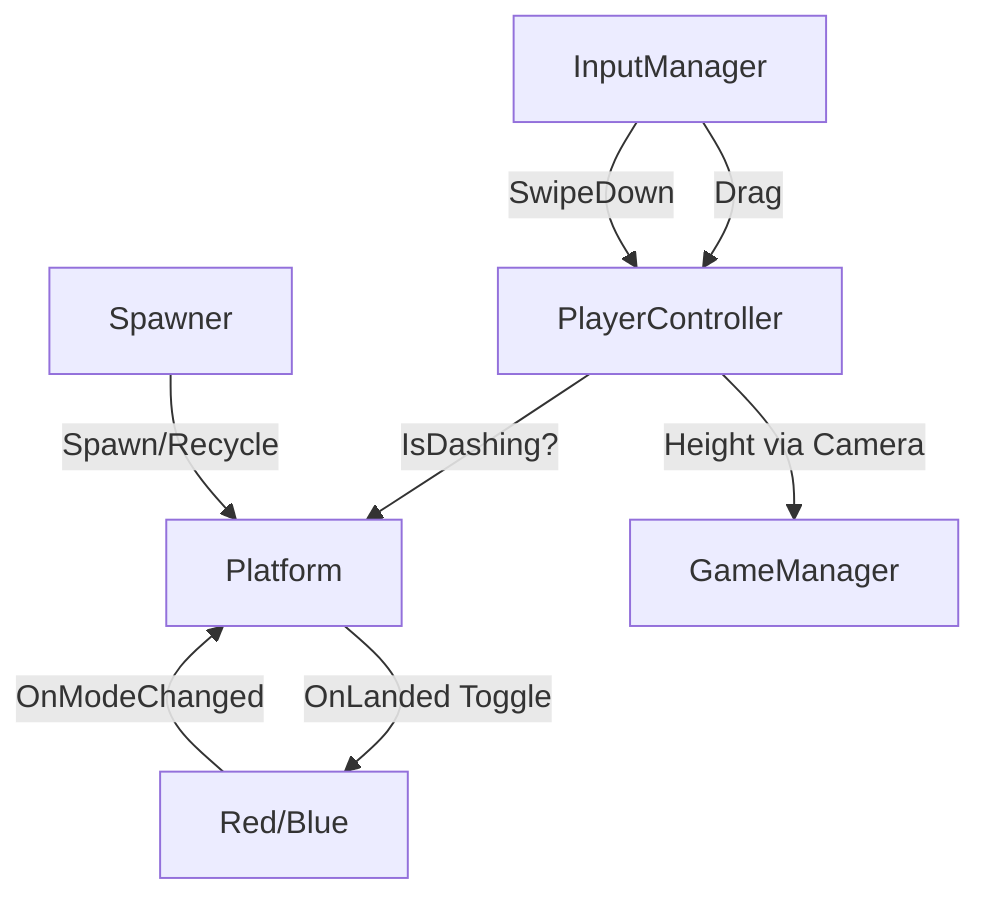

# 💻 TDD - Pair Jump (Technical Design Document)

> *Sumber kebenaran teknis per 12 Sep 2026 — dibaca langsung dari engine via MCP Unity (port 7891), bukan tebakan. Hub: [[Pair Jump]] | GDD: [[GDD - Pair Jump]]*
> *Project: `C:/Users/Paganisium/Documents/Projects/Unity/Gamejam Internal GT 2026` | Unity `6000.6.0f1` | Scene: `SampleScene`*

---

## 1. Ringkasan Teknis

| Item | Detail aktual |
|------|---------------|
| **Engine** | Unity 6 (6000.6.0f1), URP, Android platform, IL2CPP, Linear |
| **Orientasi** | Portrait 1080x1920, 60fps lock (`Application.targetFrameRate=60` di `GameManager.Awake`) |
| **Input** | Input System only (Legacy throw). Mouse + Touchscreen multi-touch |
| **Fisika** | 1x `Rigidbody2D` Dynamic (Player) + `BoxCollider2D` trigger (Platform). No alloc di Update |
| **Scene stat** | 46 GameObject, 150 component. Top: RectTransform 36, Text 20, Image 12, Button 8, Canvas 4 |
| **Script** | 11 file di `Assets/_PairJump/` (12 dengan `Welcome2DScript.cs` template yang tidak dipakai) |

Struktur folder sesuai GDD §6:
```
Assets/_PairJump/
├── Core/ GameManager.cs, GameState.cs, PairJumpInput.cs, Spawner.cs, CameraFollow.cs, FtueHints.cs
├── Player/ PlayerController.cs, PlayerMode.cs
├── Platform/ Platform.cs
└── UI/ UIManager.cs, SafeAreaPad.cs
```

---

## 2. Scene Hierarchy (aktual dari `unity_scene_hierarchy`)

```
Main Camera (Camera, AudioListener, CameraFollow, target=Player)
├── Background (SpriteRenderer)
Global Light 2D
InputManager (PairJumpInput)
Player (Rigidbody2D, CircleCollider2D, SpriteRenderer, PlayerController) pos (0,1,0)
Spawner (Spawner, player=Player)
GameManager (GameManager)
EventSystem (EventSystem + InputSystemUIInputModule)
UIManager (UIManager, wiring lengkap — lihat §7)
StaticCanvas (kosong, reserved Day 3)
DynamicCanvas (HUD saat Play)
├── HeightText + LiveBestText + StreakText (masing-masing + SafeAreaPad)
OverlayCanvas [selalu aktif — jangkar wiring tombol]
├── MainMenuPanel → Title, Subtitle, MenuBest, PlayButton, MuteButton, Howto
├── PausePanel (inactive) → Resume, PauseRestart, PauseMenu
├── GameOverPanel (inactive) → FinalHeight, NewBest (inactive), FinalBest, Retry, GOMenu
└── PauseButton (inactive saat menu, + SafeAreaPad)
WorldspaceCanvas → GameOverPanel (duplikat nganggur, kandidat hapus Day 3)
FtueHints (FtueHints, bikin 3 hint world-space saat runtime)
```

---

## 3. Spesifikasi Tiap Script

### 3.1 `Core/GameState.cs` — 12 baris
Enum FSM sederhana (skill: Simple FSM Berbasis Enum):
`MainMenu, Playing, Paused, GameOver`. Jangan tambah state baru tanpa butuh.

### 3.2 `Core/GameManager.cs` — 96 baris, Singleton SSOT
- `Instance`, `CurrentState`, `BestHeight`, `CurrentHeight`, `IsNewBest`
- `static event Action<GameState> OnStateChanged` — semua UI/player listen ini, tidak ada polling state.
- `BestKey = "pairjump_best"`, load di `Awake`, save **hanya** saat `GameOver` + `PlayerPrefs.Save()` (aman Android/WebGL).
- `UpdateState()`: satu-satunya yang boleh set `Time.timeScale` (0 saat Paused/GameOver, 1 lainnya). Aturan tetap anti bug retry-beku.
- `SubmitHeight(h)`: update Current + Best + flag NewBest. Dipanggil tiap frame dari `UIManager.Update` + sekali dari `CameraFollow` saat mati.
- `static bootPlaying`: survive reload. `Retry()` → boot Playing, `ToMenu()` → boot MainMenu. Keduanya `LoadScene(buildIndex)`.

### 3.3 `Player/PlayerMode.cs` — 2 baris
`enum PlayerMode { Red, Blue }`. Hijau bukan mode, cuma warna platform netral.

### 3.4 `Player/PlayerController.cs` — 236 baris, inti gameplay
Tuning aktual dari engine (bukan default code):
- `normalGravity=3`, `dashGravityMult=3.5`, `hangTime=0.85`, `moveSensitivity=1.2`, `dashCooldown=0.15`, `debugAutoDragPxPerFrame=0`
- `jumpVelocity = hang * g / 2` dengan `g=9.81*3` → ~12.5. Bounce pertahankan `x*0.3`.
- Setup `Awake`: `freezeRotation`, `sleepMode=NeverSleep`, `Continuous`, `WakeUp()`. **Jangan diubah** — ini fix bug Day 1 bola beku di apex.
- Event: `OnModeChanged(PlayerMode)`, `OnDashChanged(bool)`, `OnStreakChanged(int)`.
- `Start` + `HandleGameState`: hold total saat bukan Playing (`velocity=0 + gravityScale=0`). Masuk Playing: resume `savedVel` kalau >0.5 else luncur `jumpVelocity`. Keluar Playing: simpan `savedVel`, clear `IsDashing`, buang `pendingDragPx` (anti teleport pas resume).
- Input: `HandleDrag` antre ke `pendingDragPx`, `HandleSwipeDown` cek cooldown → `IsDashing=true`, `gravityScale=3*3.5`.
- `FixedUpdate`: konversi px→world via `(2*ortho*aspect)/Screen.width`, sens 1.2 (0.6 saat dash). **Geser X via `transform.position += (dx,0,0)` — JANGAN `MovePosition`** (A/B-tested 11 Sep: MovePosition delta Y=0 berantem dengan `velocity.y` → Y beku). Lalu `Wrap()` kiri-kanan via `halfW = ortho*aspect`.
- `TryLand(Platform p)`: gate `IsPlaying`, tolak `velocity.y>0.5` kecuali dashing, tolak jika bola di bawah platform -0.1. `dashActive = IsDashing || (now-dashEnd<0.05 && now-lastDash<0.3)` (coyote). `solid = p.IsSolidFor(mode, dashActive)`, ghost → return. Kalau dash → toggle Red↔Blue + reset gravity + invoke events + `RefreshAllPlatforms()` + `UpdateColor()` (Red `#FF8C8C`-ish `(1,0.55,0.55)`, Blue `(0.45,0.68,1)`). Streak: toggle +1 else reset 0. Bounce selalu.
- `Update`: safety — dash yang tidak landing tapi sudah naik (`vy>1`) → stop dash.

### 3.5 `Core/PairJumpInput.cs` — 170 baris, Input System only
- Event statik: `OnDragDeltaPixels(float dxPx)`, `OnSwipeDown`.
- Tuning scene: `swipeThresholdPx=60`, `swipeMaxTime=0.3`, `directionRatio=1.5`. `Awake`: kalau `Screen.dpi>0` → `threshold = max(60, dpi*0.25)` (~0.25 inch fisik, fix HP dpi tinggi).
- `PointerState` per touchId + `MouseId=-100`. Mouse = desktop, Touchscreen = mobile. Support multi-touch: jari 1 drag + jari 2 flick bersamaan.
- Tiap move: invoke `dx` kalau >0.01, lalu `CheckSwipe`: `dt<0.3`, `dy<-threshold`, `|dy| > |dx|*1.5`, sekali per sentuhan (`firedSwipe`).
- `IsOverUI`: skip sentuhan yang mulai di atas UI (pakai `IsPointerOverGameObject(fingerId)`). Try-catch agar tidak throw.

### 3.6 `Platform/Platform.cs` — 63 baris
- `enum PlatformColor { Red, Blue, Green }`, `col.isTrigger=true`.
- Warna solid: Red `(1,0.42,0.42)`, Blue `(0.30,0.59,1)`, Green `(0.48,0.96,0.61)` — selaras palette GDD `#FF6B6B/#4D96FF/#7BF59B`.
- `IsSolidFor(mode, dash)`: `dash→true` (v2.1 toggle bebas), `Green→true`, else cocok warna. `RefreshVisual`: alpha 1 solid else 0.25 (ghost dashed versi placeholder — ganti sprite rounded Day 3).
- `OnTriggerEnter/Stay → TryLand`: delegasi penuh ke Player (platform tidak bounce sendiri).

### 3.7 `Core/Spawner.cs` — 154 baris, solvable generator
Tuning scene (beda dari default code — scene menang): `prewarm=12`, `gapMinY=1.8`, `gapMaxY=2.4`, `maxGapX=4` (code default 3), `greenBailoutEvery=5`. `player` sudah ter-wire ke Player.
- `Start`: lantai `SpawnAt(0,0,Green,4)` + prewarm loop.
- `Update`: spawn while `nextY < cam.y+ortho` (guard 10/frame), destroy saat `y < cam.y-ortho-6`. Registry `List<Platform> live` sendiri — tidak ada `Find` per-frame.
- `SpawnNext`: `gap=Random(1.8,2.4)`, `x=Clamp(lastX±Random(maxGapX), -halfW, halfW)` → `|dX|≤maxGapX` terjaga (clamp hanya mendekatkan).
- `PickColor(y)`: `<30 Green only`, `<80 Green/Red 50/50`, `<130 TutorialPattern deterministik 12 langkah` (Red,Green,Blue,Green,Blue,Green,Red,Green,Red,Blue,Green,Blue → maks 1 toggle per lompatan), `130+ weighted 35% Green / 32% Red / 33% Blue` + bailout Hijau tiap 5 non-hijau beruntun di zona acak.
- `SpawnAt`: `GameObject "Platform_{color}_{y}"` + SpriteRenderer square putih 4x4 PPU 4 (cache statik) scale `(2.2,0.4)` + Box trigger + `Platform.color` + `RefreshVisual(mode saat ini)`.

### 3.8 `Core/CameraFollow.cs` — 55 baris, naik-only + death
- `target=Player`, `deathBuffer=2.5` (sesuai GDD).
- `highestY` + `startY`, `Height = max(0, highestY-startY)`. `LateUpdate`: kamera `y=highestY` (tidak pernah turun).
- GameOver sekali (`gameOverSent`, reset via reload): jika `target.y < highestY-ortho-deathBuffer` → `SubmitHeight(Height)` + `UpdateState(GameOver)`.

### 3.9 `Core/FtueHints.cs` — 63 baris
Bikin 3 Canvas world-space saat `Awake` (font `LegacyRuntime.ttf`, tanpa Raycaster agar tidak blokir input):
- `HintMove` y=6 `"GESER KIRI-KANAN"`, `HintColor` y=36 `"INJAK YANG SENADA"`, `HintDash` y=86 `"SWIPE BAWAH: DASH & GANTI WARNA"`.
- `Update`: visible by `cam.y`: `<28`, `28-78`, `78-128`. Scale 0.005, size 1400x300.

### 3.10 `UI/UIManager.cs` — 179 baris
Referensi sudah ter-wire semua di inspector (MainMenu/Pause/GameOver panel, PauseButton, 8 Text).
- `OnEnable`: subscribe `OnStateChanged` + `OnStreakChanged` + `WireButtons()`. **Wiring wajib di OnEnable, bukan builder** — listener runtime tidak tersimpan di scene file (penyebab PlayButton mati Day 2).
- `WireButtons`: cari `OverlayCanvas` (selalu aktif) → `GetComponentsInChildren<Button>(true)` → switch nama (Play/Pause/Resume/PauseRestart/PauseMenu/Retry/GOMenu/Mute). `Find` per tombol dilarang — buta terhadap inactive. `Rewire` = remove-then-add (idempoten).
- `Update`: hanya saat Playing → `SubmitHeight(camFollow.Height)` + `heightText "Nm"` + `liveBest "Best: Nm"`.
- `HandleStreak`: `"xN COMBO!"` atau kosong. `HandleState`: show/hide 4 elemen + isi GameOver (final/best/NewBest jika `IsNewBest && h>0.5`) + MainMenu best.
- Tombol: Play/Resume→Playing, Pause→Paused, Restart→`GameManager.Retry()`, Menu→`ToMenu()`, Mute→toggle `pairjump_mute` + label `SUARA: ON/OFF` (stub — AudioManager Day 3).

### 3.11 `UI/SafeAreaPad.cs` — 43 baris
Geser RectTransform ke dalam `Screen.safeArea` (notch HP), sadar `scaleFactor`, sekali saja (`applied` flag). Terpasang di: PauseButton, HeightText, LiveBestText, StreakText. No-op di editor.

---

## 4. Alur Data & Event

```
Touch/Mouse → PairJumpInput (dx px / swipe) → PlayerController (queue drag, dash flag)
Platform trigger → PlayerController.TryLand → IsSolidFor? → toggle mode?
  → OnModeChanged → RefreshAllPlatforms + UpdateColor
  → OnDashChanged / OnStreakChanged → UIManager
CameraFollow.Height → UIManager.Update → GameManager.SubmitHeight → Best
CameraFollow jatuh → GameManager.UpdateState(GameOver) → UIManager.HandleState
Tombol → UIManager → GameManager.UpdateState / Retry / ToMenu (reload scene)
```

Mermaid (dari GDD, masih valid):


---

## 5. Pattern & Skill Vault Terkait

- ✅ Simple FSM Enum (`GameState`, `PlayerMode`) — [[Simple FSM Berbasis Enum (Game State Prototyping)]]
- ✅ Centralized State Manager + SSOT (`GameManager` satu-satunya pemilik state/best) — [[Centralized State Manager (GameManager Singleton & Event)]] + [[Single Source of Truth (SSOT)]]
- ✅ Observer (`OnStateChanged`, `OnModeChanged`, `OnDashChanged`, `OnStreakChanged`) — [[Observer Pattern Events]]
- ✅ FTUE zonasi + hint in-world — [[Tutorial Level Building Blocks]] + [[Framework Kihon-Kata-Kumite (Learning Curve & Encounter Design)]]
- ⚠️ Object Pooling **belum**: `Spawner` masih `Destroy` + `new GameObject` + `MakeSquare` cache. GDD minta pool ~20. Tech debt Day 3 kalau GC spike di HP (prioritas rendah untuk jam — alokasi hanya saat spawn, bukan per-frame).

---

## 6. Tech Debt & Risiko Day 3 (dari kode aktual)

1. `maxGapX` scene=4 vs code default 3 — jangan revert via code, ubah di inspector saja. 4 masih reachable dengan sens 1.2 + wrap, tapi uji HP dulu.
2. `WorldspaceCanvas/GameOverPanel` nganggur — hapus atau abaikan biar tidak bingung.
3. `applicationIdentifier` masih `com.DefaultCompany` — ganti sebelum submit (catatan Blok F).
4. Audio: `MuteButton` cuma flag. Butuh `AudioManager` + pool `AudioSource` + 5 SFX + BGM loop ogg (lihat checklist Day 3 di [[Pair Jump]]).
5. Visual placeholder: player kotak/bulat polos + platform square putih di-tint. Ganti ke rounded rect + squash-stretch + trail + partikel landing (jangan tambah warna di luar palette `#FF6B6B/#4D96FF/#7BF59B/#1A1C2C`).
6. Jangan edit code saat Play nyala + selalu `Assets/Refresh` habis edit (aturan tetap Blok F — file watcher skip = assembly basi).

---

## 7. Verifikasi Kebenaran Dokumen Ini

- Semua path + angka tuning dibaca via `unity_script_read` + `unity_component_get_properties` 12 Sep 2026.
- Hierarchy via `unity_scene_hierarchy` (46 objek) + `unity_scene_stats`.
- Tidak ada tebakan: kalau ragu, cek ulang via MCP sebelum ubah kode.

---
#unity #architecture #technical #gamejam #pair-jump
