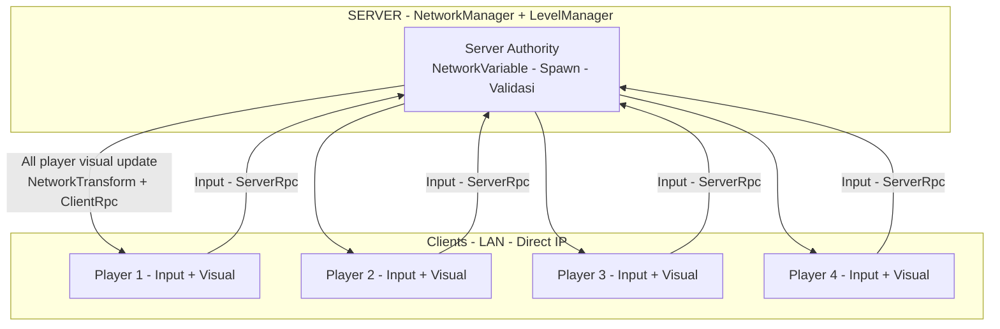
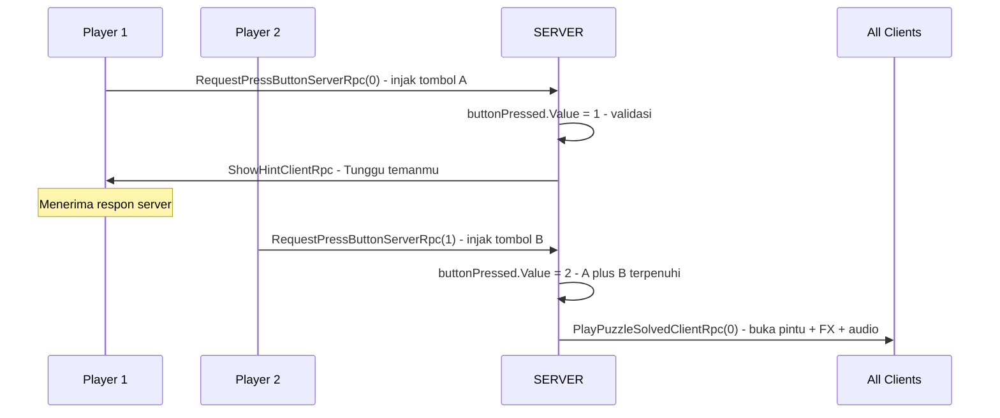
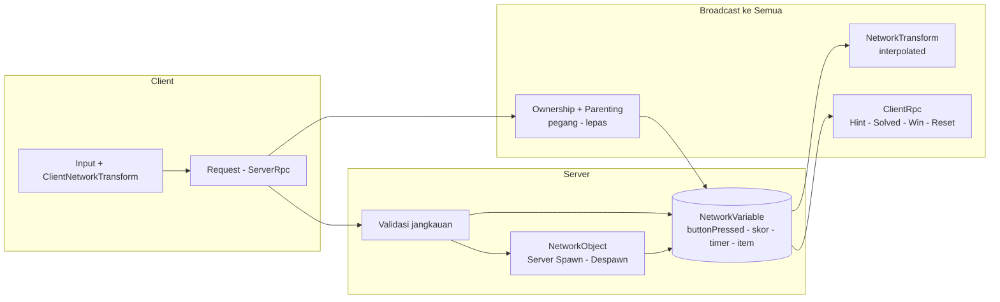

# 📄 GDD - Solve Together (Ringkas)

> Kelompok 4 — Tugas PBL Kuliah. Co-op Puzzle 2D Side Scroller, max 4 pemain, Unity 6 + NGO.

## 1. Identitas

| Info | Detail |
|------|--------|
| **Judul** | Solve Together |
| **Anggota** | Ahmad Ramadhani - 5224600032, Syahrandy Waskito - 5224600035, Satya Bagus Kenantaka - 5224600038, Fisyahbilillah Mayrizqy Nurhanifah - 5224600053 |
| **Engine** | Unity 6 |
| **Network** | LAN / Direct IP via Unity Transport, listen server (1 Host + 3 Client) |
| **Visual** | 2D |

## 2. Konsep Game

Game Co-op Puzzle 2D Side Scroller max 4 orang. Tujuan tiap level: selesaikan puzzle untuk buka pintu ke level berikutnya.

Artstyle: Flat Rounded Cartoons.
- **Character Design:** Chibi Character dengan warna berbeda setiap player
- **Environment Design:** Simple Flat Background dan Simple Flat Tilemaps

Win / Lose:
- **Win:** Puzzle solve dan pintu menuju level berikutnya terbuka
- **Lose:** Satu player terkena Hazards, game dianggap kalah

## 3. Core Gameplay Loop

`START → SOLVE PUZZLE → FINISH → START (next level)`

- START: semua player spawn di awal level
- SOLVE PUZZLE: injak tombol / sinkronisasi aksi bareng (contoh: tombol A + tombol B)
- FINISH: pintu terbuka, semua masuk → level berikutnya

## 4. Rencana Arsitektur Sinkronisasi
Server-authoritative. SERVER = NetworkManager + LevelManager. Semua state penting milik server, client cuma kirim input via ServerRpc dan terima visual via NetworkTransform + ClientRpc.

### 4.1 Topologi Listen Server

> 1 Host bertindak sebagai server + player, 3 perangkat lain sebagai client. Semua lewat Unity Transport LAN.

### 4.2 Alur Puzzle Tombol A + B

- player 1 injak tombol A → `RequestPressButtonServerRpc(0)` → `buttonPressed.Value = 1` → `ShowHintClientRpc("Tunggu temanmu!")`
- player 2 injak tombol B → `RequestPressButtonServerRpc(1)` → `buttonPressed.Value = 2` → `PlayPuzzleSolvedClientRpc(0)` ke semua → pintu terbuka

### 4.3 Pemetaan NGO ke Alur Data

Pemetaan NGO:
- **NetworkManager + Unity Transport:** Host/Client via IP lokal
- **NetworkTransform / ClientNetworkTransform:** posisi + rotasi avatar, interpolated
- **NetworkObject + Server Spawning:** spawn/despawn pickable items oleh server
- **NetworkVariable:** `buttonPressed`, skor tim, timer, status item
  - `buttonPressed.Value = 1` (tombol A), `= 2` (tombol A+B / solved)
- **ServerRpc:** `RequestPressButtonServerRpc(int id)` — validasi jangkauan sebelum ambil/injak
- **ClientRpc:** `ShowHintClientRpc(string)`, `PlayPuzzleSolvedClientRpc(int)` — efek, audio, pengumuman, reset
- **Ownership & Parenting:** pindah ownership saat item dipegang/dilepas

## 5. Game Reference

- **Pico Park:** sebagai gameplay utama (co-op puzzle, stack, timing bareng)
- **Poinpy:** sebagai referensi artstyle (flat rounded, warna cerah)

## 6. Pembagian Tugas

- **Ahmad Ramadhani - Programmer** (Rama / AGY)
- **Satya Bagus Kenantaka - Level Designer**
- **Syahrandy Waskito - 2D Environment Artist**
- **Fisyahbilillah Mayrizqy Nurhanifah - 2D Character Artist**

## 7. Scope PBL

- Tepat 1 level playable, terpoles, bebas desync
- Genre inti PBL: Pick-up and Deliver (ambil objek → lewati rintangan → antar ke zona target) — diadaptasi ke puzzle pintu co-op
- Aset eksternal boleh (Asset Store, itch.io, Kenney) wajib kredit + lisensi di GDD final

## 🔗 Lihat Juga

- [[Solve Together]] — Index proyek
- [[Timeline]] — Target 6 minggu
- [[PBL Brief - NGO]] — Komponen wajib Netcode detail
