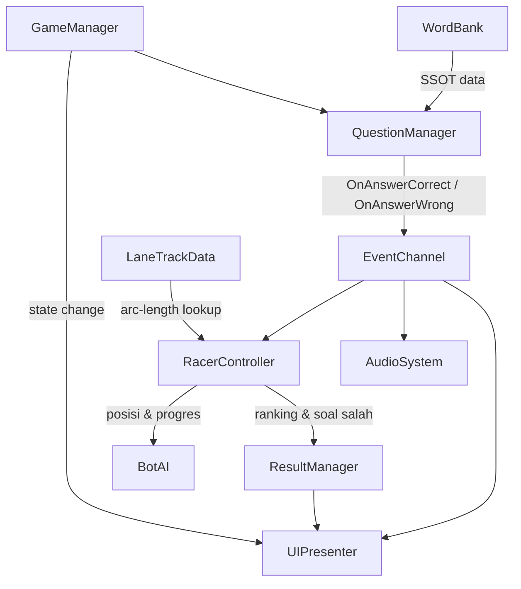

# 📋 GDD — Word Space

> GDD dibuat mengikuti [[Projects/Ideas/Format Game Design|Format Game Design]]. Tugas Kuliah — Gamifikasi Edukasi (1 dari 3 tugas game edukasi kuliah).

---

## 🎮 1. Konsep & Identitas Game

- **Premis**: Game ini adalah Racing Quiz Gamifikasi di mana pemain mencocokkan kata Bahasa Indonesia ke pilihan kata Bahasa Inggris yang tepat untuk mempercepat pesawat luar angkasanya menuju garis finish.
- **Genre**: Racing Quiz / Gamifikasi Edukasi
- **Target Platform**: TV/proyektor kelas, dioperasikan langsung di sesi belajar
- **Target Subject (B2B)**: Guru/sekolah TK swasta
- **End User**: Anak TK, pra-literasi (belum fasih baca)
- **USP**: Mekanik racing bikin drilling vocab kerasa kayak main, bukan kuis — dibantu voice over + gambar biar anak yang belum bisa baca tetap paham soalnya
- **Referensi & Inspirasi**: Pola umum game quiz-race edukasi (jawab benar = boost, salah = slow, ranking di akhir)

---

## 🔄 2. Core Gameplay Loop

- **Loop Utama**: `MAIN MENU → START → INPUT NAMA → NEXT → LOBBY → START → LEVEL → COUNTDOWN → BERMAIN → FINISH → RESULT → PLAY AGAIN → (kembali ke INPUT NAMA)`
- **Core Mechanic**: Cocok-kata Indonesia → Inggris yang berpengaruh langsung ke kecepatan pesawat (jawaban benar = boost, salah = slowdown)
- **Daya Tarik Jangka Pendek**: Race 4 lane melawan 3 bot dengan feedback instan (particle boost, screen-shake/slow-mo pas salah); kalau main lancar, race selesai ~50 detik — cepat dan bisa diulang
- **Daya Tarik Jangka Panjang**: Kategori kata baru & variasi track/skin pesawat sebagai insentif main ulang (di luar scope MVP 1 bulan)

---

## ⚔️ 3. Mekanik Utama

- **Mekanik 1 — Cocok Kata Bahasa Inggris**: Soal muncul sebagai 1 kata Indonesia + beberapa pilihan Inggris; distractor dibuat semantically related (misal semua furniture) biar bener-bener nguji vocab, bukan tebak-tebakan
- **Mekanik 2 — Boost/Slow Berdasarkan Jawaban**: Jawaban benar → speed boost sementara; salah → slowdown sementara; efek drop-off setelah durasi tertentu, bukan permanen
- **Mekanik 3 — Multi-Lane Racing vs Bot**: 4 lane terpisah (pemain + 3 bot), gak ada tabrakan fisik; bot pakai rubber-banding biar race tetap seru sampai akhir
- **Mekanik 4 — Voice Over + Gambar**: Soal dibacain + dibantu ilustrasi, teks cuma pelengkap — krusial buat target anak TK yang belum fasih baca

> 4 mekanik ini cukup buat MVP; belum nambah mekanik lain di scope 1 bulan pertama.

---

## 💻 4. Arsitektur Data & Design Pattern *(Prioritas Utama)*

- **Design Pattern Pilihan**:
  - [[Simple FSM Berbasis Enum (Game State Prototyping)]] + [[Centralized State Manager (GameManager Singleton & Event)]] — state `MainMenu/NameInput/Lobby/Countdown/Racing/Finish/Result`
  - [[Observer Pattern Events]] — broadcast `OnAnswerCorrect`/`OnAnswerWrong` ke sistem boost, UI, audio tanpa coupling langsung
  - [[Flyweight Pattern (Unity Shared Data)]] — `WordBank` (SSOT bank kata) dipakai bareng semua instance soal
  - [[Factory Pattern (Unity)]] — spawn 3 bot racer dengan nama random & profil kecepatan berbeda
  - [[MVP Pattern (Unity UI)]] — pemisahan logic vs tampilan buat Lobby, HUD soal, Result
  - [[Dirty Flag Pattern (Unity)]] — Result screen update cuma pas datanya berubah
  - [[Decoupled Audio System (Event Channel & Pooling)]] — voice over & SFX lewat event channel
- **Arsitektur & Penyimpanan Data**: `WordEntry`/`WordBank` sebagai ScriptableObject SSOT; `LaneTrackData` (arc-length table per lane) di-bake sekali dan disimpan sebagai asset; `GameManager` Singleton pegang state global



---

## 🏛️ 5. Desain FTUE

- **Pendekatan FTUE**: Contextual + Voice-Guided — karena target anak TK pra-literasi, gak pakai tutorial popup teks panjang. Voice over kasih instruksi verbal sederhana pas soal pertama muncul (misal "pilih kata yang cocok!"), dan countdown 3-2-1 sebelum race berfungsi sekaligus sebagai sinyal implisit "sekarang mulai main". Flow `Input Nama → Lobby → Countdown` juga udah cukup pendek buat gak butuh onboarding terpisah.

---

## 🚀 6. Struktur Folder Modular & Optimisasi Performa

**Struktur Folder (Feature-Based, Unity)**:

```
Assets/_Project/WordSpace/
├── 01_Core/
│   ├── GameManager.cs
│   ├── GameState.cs (enum)
│   └── EventChannels/ (AnswerEventChannel, GameStateEventChannel)
├── 02_Track/
│   ├── LaneTrackData.cs (ScriptableObject: positions[], cumulativeDistances[], totalLength)
│   ├── TrackBaker.cs (Editor tool: bake spline → arc-length table)
│   └── PathFollower.cs (runtime lookup posisi+tangent dari currentDistance)
├── 03_Racer/
│   ├── RacerController.cs (currentDistance, speedMultiplier)
│   ├── SpeedModifier.cs (boost/slow drop-off logic)
│   └── BotAI.cs (jawab probabilistik + rubber-banding)
├── 04_Question/
│   ├── WordEntry.cs (ScriptableObject)
│   ├── WordBank.cs (ScriptableObject)
│   └── QuestionManager.cs
├── 05_Audio/
│   ├── VoiceOverPlayer.cs
│   └── SFXPool.cs
├── 06_UI/
│   ├── MainMenu/, NameInput/, Lobby/
│   ├── HUD/ (soal aktif, indikator boost/slow)
│   └── Result/ (ranking + list soal salah)
└── 07_Data/
    └── WordCategories/ (aset WordBank per kategori)
```

- Tiap folder fitur (`02_Track`, `03_Racer`, `04_Question`, `06_UI`) dipisah pakai Assembly Definition (`.asmdef`) sendiri-sendiri, biar compile time gak melebar tiap kali ubah 1 fitur
- **Rencana Optimisasi**:
  - *CPU/Memori*: Arc-length table di-bake sekali di Editor (bukan `EvaluatePosition` tiap frame); Object Pooling buat particle boost/slow-mo effect
  - *Rendering/UI*: Canvas Splitting — HUD dinamis (soal, indikator boost) dipisah dari elemen statis (background lobby, dekorasi), biar rebuild layout gak sering ke-trigger pas soal berganti

---

## 📏 7. Scope & Feasibility

- **Estimasi Durasi**: 1 bulan (4 minggu), solo dev
- **Ukuran Tim**: Solo (Rama / King)
- **Risiko Teknis**: Arc-length movement multi-lane di jalur belok (termasuk mastiin 4 lane `totalLength` konsisten); balancing bot rubber-banding; produksi aset voice over
- **Risiko Desain**: Apakah loop cocok-kata + racing kerasa fun (bukan berasa kuis biasa) buat anak TK — belum divalidasi lewat playtest langsung ke kelas
- **Kriteria "Go/No-Go"**: Prototype 1 lane + 1 kategori kata + boost/slow + Result screen (ranking + list soal salah) udah jalan mulus

---

## 📎 Appendix — Detail Tambahan

### A. Isi Result Screen
- **Ranking** 4 pembalap (posisi finish)
- **List pertanyaan yang dijawab salah** — soal + semua pilihan jawaban, jawaban benar di-highlight
- Waktu tempuh, akurasi, dan rata-rata soal/menit sengaja dihilangin biar result screen fokus, gak kebanyakan angka buat anak TK

### B. Balancing Reference
- [[Model Progress Curves]] — kurva progresi kesulitan soal sepanjang race
- [[Establish Math Anchors]] — angka dasar buat tuning kecepatan boost/slowdown & rubber-banding bot
- [[SOLID Principles (Unity)]] — baseline prinsip semua sistem di atas
- Target pacing: ~20 soal/menit, jawab benar semua → race selesai ~50 detik (detail matematika di [[Planning - Word Space]] §4)

## 🔗 Lihat Juga

- [[Planning - Word Space]] — rencana teknis detail implementasi & timeline mingguan
