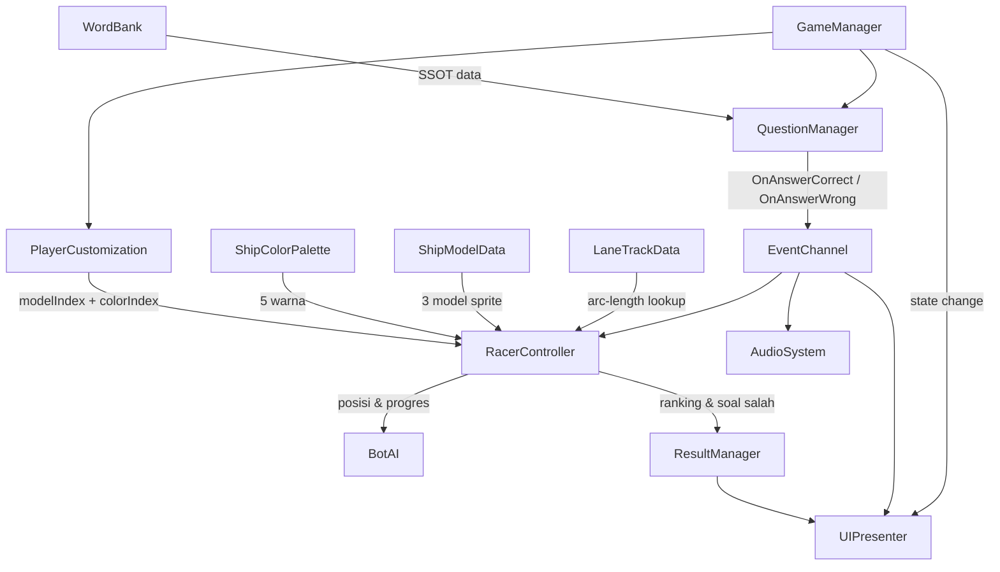

# 📋 GDD — Word Space

> GDD dibuat mengikuti [[Projects/Ideas/Format Game Design|Format Game Design]]. Tugas Kuliah — Gamifikasi Edukasi (1 dari 3 tugas game edukasi kuliah).

---

## 🎮 1. Konsep & Identitas Game

- **Premis**: Game ini adalah Racing Quiz Gamifikasi di mana pemain mencocokkan kata Bahasa Indonesia ke pilihan kata Bahasa Inggris yang tepat untuk mempercepat pesawat luar angkasanya menuju garis finish.
- **Genre**: Racing Quiz / Gamifikasi Edukasi, 2D Top-Down
- **Visual & Kamera**: 2D top-down (orthographic camera, sprite-based); track dan 4 lane terlihat dari atas, pesawat bergerak sepanjang lane dari start ke finish
- **Target Platform**: TV/proyektor kelas, dioperasikan langsung di sesi belajar
- **Target Subject (B2B)**: Guru/sekolah TK swasta
- **End User**: Anak TK, pra-literasi (belum fasih baca)
- **USP**: Mekanik racing bikin drilling vocab kerasa kayak main, bukan kuis — dibantu voice over + gambar biar anak yang belum bisa baca tetap paham soalnya
- **Referensi & Inspirasi**: Pola umum game quiz-race edukasi (jawab benar = boost, salah = slow, ranking di akhir)

## 🔄 2. Core Gameplay Loop

- **Loop Utama**: `MAIN MENU → START → INPUT NAMA → NEXT → LOBBY (pilih 1 dari 3 model pesawat + 1 dari 5 warna) → START → LEVEL → COUNTDOWN → BERMAIN → FINISH → RESULT → PLAY AGAIN → (kembali ke INPUT NAMA)`
- **Core Mechanic**: Cocok-kata Indonesia → Inggris yang berpengaruh langsung ke kecepatan pesawat (jawaban benar = boost, salah = slowdown)
- **Kustomisasi di Lobby**: Pemain pilih model pesawat (3 pilihan) dan warna pesawat (5 pilihan: Merah, Biru, Kuning, Hijau, Ungu) sebelum START; preview langsung tampil di Lobby, murni kosmetik
- **Daya Tarik Jangka Pendek**: Race 4 lane melawan 3 bot dengan feedback instan (particle boost, screen-shake/slow-mo pas salah); kalau main lancar, race selesai ~50 detik — cepat dan bisa diulang
- **Daya Tarik Jangka Panjang**: Kategori kata baru & variasi track sebagai insentif main ulang (di luar scope MVP 1 bulan); kustomisasi pesawat (3 model x 5 warna) sudah masuk MVP sebagai motivasi main ulang jangka menengah

## ⚔️ 3. Mekanik Utama

- **Mekanik 1 — Cocok Kata Bahasa Inggris**: Soal muncul sebagai 1 kata Indonesia + beberapa pilihan Inggris; distractor dibuat semantically related (misal semua furniture) biar bener-bener nguji vocab, bukan tebak-tebakan
- **Mekanik 2 — Boost/Slow Berdasarkan Jawaban**: Jawaban benar → speed boost sementara; salah → slowdown sementara; efek drop-off setelah durasi tertentu, bukan permanen
- **Mekanik 3 — Multi-Lane Racing vs Bot**: 4 lane terpisah (pemain + 3 bot), gak ada tabrakan fisik; bot pakai rubber-banding biar race tetap seru sampai akhir; disajikan 2D top-down dengan sprite pesawat terlihat dari atas
- **Mekanik 4 — Voice Over + Gambar**: Soal dibacain + dibantu ilustrasi, teks cuma pelengkap — krusial buat target anak TK yang belum fasih baca
- **Mekanik 5 — Kustomisasi Pesawat (3 Model x 5 Warna)**: Di Lobby, pemain pilih 1 dari 3 model pesawat (misal: Rocket, Shuttle, Saucer — hitbox & speed sama, beda visual saja) + 1 dari 5 warna (Merah, Biru, Kuning, Hijau, Ungu). Murni kosmetik, tidak mempengaruhi kecepatan/boost biar fair; pilihan tersimpan per sesi dan dipakai untuk racer pemain (bot pakai kombinasi sisa/acak)

> 5 mekanik ini cukup buat MVP; belum nambah mekanik lain di scope 1 bulan pertama.

## 💻 4. Arsitektur Data & Design Pattern *(Prioritas Utama)*

- **Design Pattern Pilihan**:
  - [[Simple FSM Berbasis Enum (Game State Prototyping)]] + [[Centralized State Manager (GameManager Singleton & Event)]] — state `MainMenu/NameInput/Lobby/Countdown/Racing/Finish/Result`
  - [[Observer Pattern Events]] — broadcast `OnAnswerCorrect`/`OnAnswerWrong` ke sistem boost, UI, audio tanpa coupling langsung; broadcast `OnCustomizationChanged` untuk preview Lobby 2D top-down
  - [[Flyweight Pattern (Unity Shared Data)]] — `WordBank` (SSOT bank kata) dipakai bareng semua instance soal; `ShipModelData` (3 sprite model 2D top-down) + `ShipColorPalette` (5 warna) dipakai bareng semua racer
  - [[Factory Pattern (Unity)]] — spawn 3 bot racer dengan nama random, profil kecepatan berbeda, dan kombinasi model/warna sisa/acak
  - [[MVP Pattern (Unity UI)]] — pemisahan logic vs tampilan buat Lobby (termasuk kustomisasi model/warna), HUD soal, Result
  - [[Dirty Flag Pattern (Unity)]] — Result screen update cuma pas datanya berubah; preview pesawat Lobby update cuma pas pilihan berubah
  - [[Decoupled Audio System (Event Channel & Pooling)]] — voice over & SFX lewat event channel
- **Arsitektur & Penyimpanan Data**: `WordEntry`/`WordBank` sebagai ScriptableObject SSOT; `LaneTrackData` (arc-length table per lane, untuk movement 2D top-down) di-bake sekali dan disimpan sebagai asset; `ShipModelData` (3 model) + `ShipColorPalette` (Merah, Biru, Kuning, Hijau, Ungu) sebagai ScriptableObject SSOT; `PlayerCustomization` (modelIndex 0-2, colorIndex 0-4) dipegang `GameManager` Singleton; `GameManager` Singleton pegang state global


```mermaid
graph TD
    GameManager -->|state change| UIPresenter
    GameManager --> QuestionManager
    GameManager --> PlayerCustomization
    WordBank -->|SSOT data| QuestionManager
    QuestionManager -->|OnAnswerCorrect / OnAnswerWrong| EventChannel
    EventChannel --> RacerController
    EventChannel --> AudioSystem
    EventChannel --> UIPresenter
    LaneTrackData -->|arc-length lookup| RacerController
    ShipModelData -->|3 model sprite| RacerController
    ShipColorPalette -->|5 warna| RacerController
    PlayerCustomization -->|modelIndex + colorIndex| RacerController
    RacerController -->|posisi & progres| BotAI
    RacerController -->|ranking & soal salah| ResultManager
    ResultManager --> UIPresenter
```

## 🏛️ 5. Desain FTUE

- **Pendekatan FTUE**: Contextual + Voice-Guided — karena target anak TK pra-literasi, gak pakai tutorial popup teks panjang. Voice over kasih instruksi verbal sederhana pas soal pertama muncul (misal "pilih kata yang cocok!"), dan countdown 3-2-1 sebelum race berfungsi sekaligus sebagai sinyal implisit "sekarang mulai main". Flow `Input Nama → Lobby → Countdown` juga udah cukup pendek buat gak butuh onboarding terpisah.

---

## 🚀 6. Struktur Folder Modular & Optimisasi Performa

**Struktur Folder (Feature-Based, Unity 2D)**:

```
Assets/
├── 01_Core/
│   ├── GameManager.cs
│   ├── GameState.cs (enum)
│   ├── PlayerCustomization.cs (modelIndex 0-2, colorIndex 0-4)
│   └── EventChannels/ (AnswerEventChannel, GameStateEventChannel, CustomizationEventChannel)
├── 02_Track/
│   ├── LaneTrackData.cs (ScriptableObject: positions[], cumulativeDistances[], totalLength, untuk 2D top-down)
│   ├── TrackBaker.cs (Editor tool: bake spline → arc-length table)
│   └── PathFollower.cs (runtime lookup posisi 2D + rotasi sprite dari currentDistance)
├── 03_Racer/
│   ├── RacerController.cs (currentDistance, speedMultiplier, SpriteRenderer 2D)
│   ├── SpeedModifier.cs (boost/slow drop-off logic)
│   ├── BotAI.cs (jawab probabilistik + rubber-banding)
│   ├── ShipModelData.cs (ScriptableObject: 3 model sprite top-down)
│   ├── ShipColorPalette.cs (ScriptableObject: 5 warna - Merah, Biru, Kuning, Hijau, Ungu)
│   └── ShipCustomizer.cs (apply model+warna ke pemain/bot)
├── 04_Question/
│   ├── WordEntry.cs (ScriptableObject)
│   ├── WordBank.cs (ScriptableObject)
│   └── QuestionManager.cs
├── 05_Audio/
│   ├── VoiceOverPlayer.cs
│   └── SFXPool.cs
├── 06_UI/
│   ├── MainMenu/, NameInput/, Lobby/ (Lobby: pemilih 3 model + 5 warna + preview 2D)
│   ├── HUD/ (soal aktif, indikator boost/slow)
│   └── Result/ (ranking + list soal salah)
└── 07_Data/
    ├── WordCategories/ (aset WordBank per kategori)
    └── Ships/ (aset ShipModelData + ShipColorPalette)
```

- Tiap folder fitur (`02_Track`, `03_Racer`, `04_Question`, `06_UI`) dipisah pakai Assembly Definition (`.asmdef`) sendiri-sendiri, biar compile time gak melebar tiap kali ubah 1 fitur
- **Rencana Optimisasi**:
  - *CPU/Memori*: Arc-length table di-bake sekali di Editor (bukan `EvaluatePosition` tiap frame); Object Pooling buat particle boost/slow-mo effect; 3 model x 5 warna pakai shared sprite + tint (Flyweight) biar memori kecil
  - *Rendering/UI*: 2D top-down (Orthographic camera, SpriteRenderer, Sorting Layer per lane); Canvas Splitting — HUD dinamis (soal, indikator boost) dipisah dari elemen statis (background lobby, dekorasi), biar rebuild layout gak sering ke-trigger pas soal berganti

## 📏 7. Scope & Feasibility

- **Estimasi Durasi**: 1 bulan (4 minggu), solo dev
- **Ukuran Tim**: Solo (Rama / King)
- **Visual Scope**: 2D top-down (orthographic, sprite-based) — tidak ada model 3D, cukup 3 sprite pesawat top-down + tint 5 warna
- **Risiko Teknis**: Arc-length movement multi-lane 2D di jalur belok (termasuk mastiin 4 lane `totalLength` konsisten); balancing bot rubber-banding; produksi aset voice over; 3 sprite model + sistem tint 5 warna (risiko rendah, kosmetik saja)
- **Risiko Desain**: Apakah loop cocok-kata + racing kerasa fun (bukan berasa kuis biasa) buat anak TK — belum divalidasi lewat playtest langsung ke kelas; apakah pilihan 3 model x 5 warna cukup memotivasi tanpa membingungkan anak TK
- **Kriteria "Go/No-Go"**: Prototype 2D top-down 1 lane + 1 kategori kata + boost/slow + Lobby (pilih 3 model + 5 warna) + Result screen (ranking + list soal salah) udah jalan mulus

## 📎 Appendix — Detail Tambahan

### A. Isi Result Screen
- **Ranking** 4 pembalap (posisi finish)
- **List pertanyaan yang dijawab salah** — soal + semua pilihan jawaban, jawaban benar di-highlight
- Waktu tempuh, akurasi, dan rata-rata soal/menit sengaja dihilangin biar result screen fokus, gak kebanyakan angka buat anak TK

### B. Balancing Reference
- [[Model Progress Curves]] — kurva progresi kesulitan soal sepanjang race
- [[Establish Math Anchors]] — angka dasar buat tuning kecepatan boost/slowdown & rubber-banding bot
- [[SOLID Principles (Unity)]] — baseline prinsip semua sistem di atas
- Target pacing: ~20 soal/menit, jawab benar semua → race selesai ~50 detik (detail matematika di [[Planning - Word Space]] §4)

## 🔗 Lihat Juga

- [[Planning - Word Space]] — rencana teknis detail implementasi & timeline mingguan
