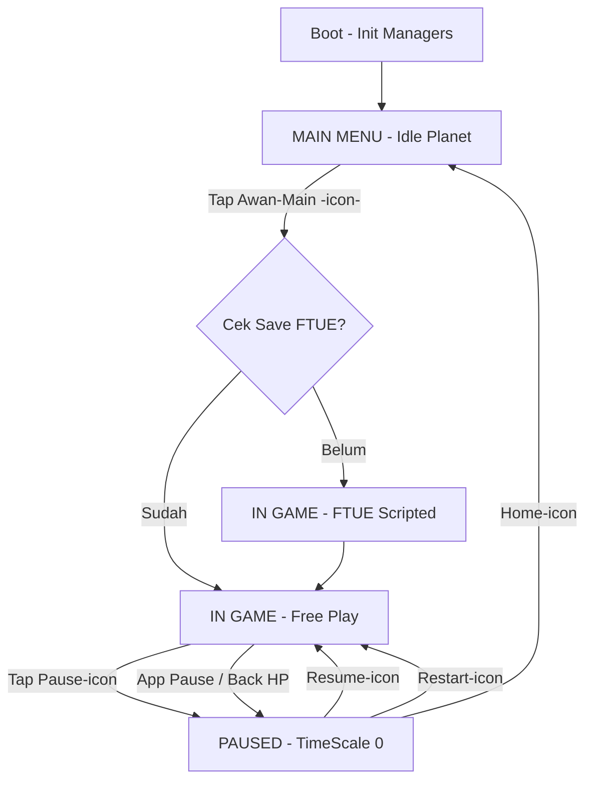

# AWAN // Tukang Hujan - Concept Keep (Revisi Sketsa)

> Update 21 Sep 2026 sesuai sketsa King. Fun 80% Edu 20%. No angka & huruf. No chocolate-covered broccoli.
> Opsi visual: A (pecah slot tanah). Plan dev di bagian 9.

## 1. Konsep & Identitas
- **Premis:** Game ini adalah 2D santai mobile di mana pemain menggeser awan, menggabungkan awan jadi besar, dan menghujani tanah biar tanaman tumbuh & berbunga, di atas planet kecil melingkar yang bisa diputar.
- **Genre:** 2D Merge-Drag / Ecosystem Sandbox, Casual
- **Target Platform:** Mobile, 2D, LANDSCAPE, 1 jari (single control: drag/geser doang)
- **USP:** Siklus air dimainin langsung: Stay (evaporasi) > Merge (kondensasi) > Hujan (presipitasi) > Kecil lagi + dunia melingkar yang diputar dengan cara digeser. Bukan teori, tapi verb.
- **Referensi:** Seperti 2048 merge-feel + Tiny Wings chill + Tamagotchi ekosistem + Loop World ala Tiny Planet.

## 2. Core Loop (revisi)
Geser awan ke atas genangan > diem di atas air (evaporasi) > geser + overlap 2 awan buat merge (kondensasi jadi besar & gelap) > drag awan ke edge buat muter daratan ke area target > awan gelap hujan otomatis (presipitasi) > awan menyusut jadi kecil putih > merge lagi atau biarin regen > tanah basah > tanaman tumbuh > subur berbunga > putar lagi cari lahan baru

- **Core Mechanic:** Cuma geser. Overlap = merge. Edge-drag = putar dunia.
- **Daya tarik 5 menit:** Merge pop satisfying + hujan deres + muter planet yang tactile.
- **Daya tarik panjang:** Jaga banyak titik tanah tetap basah di sekeliling planet, rotasi prioritas, kejar bunga sebanyak-banyaknya.

## 3. Sistem Detail (sesuai sketsa)

### LANDSCAPE / Siklus
`Genangan -> (stay/evaporasi) -> Awan kecil -> MERGE (kondensasi) -> Awan besar gelap -> MERGED -> Presipitasi hujan -> jadi kecil lagi -> balik ke genangan`
- Layout landscape: kamera fixed di langit, daratan melengkung di bawah sebagai busur planet.

### WORLD / DARATAN MELINGKAR (baru)
- Player bisa menggeser daratan untuk pindah area.
- Daratan berbentuk lingkaran (planet kecil), sehingga ketika digeser terus menerus bisa kembali ke lokasi awal.
- Dari POV developer ini "memutar" daratan (rotasi angle planet), tapi bagi player ini terasa menggeser daratannya (parallax horizontal).
- Implementasi: planet = circle, kamera diam, putar container daratan di sumbu Z. Awan tetap di screen-space langit.
- Edukasi bonus: planet bulat + horizon melengkung kebaca visual tanpa teks.

### PLAYER (update)
- Player menggerakkan awan dengan cara menggeser awan (drag 1 jari).
- Player menggabungkan awan dengan cara menempatkan dua awan atau lebih secara overlap.
- Player bisa menggeser awan lalu didrag ke paling kanan atau kiri layar untuk otomatis menggeser daratan dan memindahkan awan (edge-scroll).
  - Drag awan ke edge kanan > planet muter kiri (area baru masuk dari kanan).
  - Drag awan ke edge kiri > planet muter kanan.
  - Awan ikut kebawa secara visual, tapi logikanya dunia yang muter.
- Player juga bisa geser daratan langsung (drag tanah kosong kiri/kanan) untuk eksplor tanpa bawa awan — tetap 1 jari, tidak nambah tombol.

### AWAN
- Awan yang sudah menjadi gelap, akan otomatis hujan.
- Hujan berlangsung sampai awan menjadi kecil dan berwarna putih (awan kecil).
- Awan kecil (putih kecil) memiliki waktu hidup sekian detik (pendek, harus cepat di-merge / dipakai).
- Awan normal (putih sedang) memiliki jangka waktu yang lama (awan kerja utama).
- Awan kecil bisa menjadi awan normal dengan cara digabungkan dengan awan lain.
- Rumus: Awan + Awan = Awan lebih besar.
- Awan tidak ikut rotasi planet (tetap di langit), hanya daratan yang muter — jadi pemain harus timing mindahin hujan ke atas lahan target.

### GENANGAN AIR
- Menghasilkan awan (spawner pasif).
- Fungsi: tempat evaporasi — stay in top of water = isi ulang / munculin awan baru.
- Genangan menempel di planet (ikut muter), jadi kadang harus muter dulu buat cari air.

### TANAH (Opsi A - Slot)
- Dipilih Opsi A: tanah dipecah jadi N slot sprite (misal 12 slot) mengelilingi planet. Terlihat menyatu, logik per-slot.
- Tanah bisa kering dalam waktu tertentu.
- Tanah bisa basah jika terkena hujan.
- Visual only: kering (pucat/retak) vs basah (gelap). Tanpa angka, tanpa teks.

### TANAMAN
- Tanaman bisa kering dan mati dalam jangka tertentu (kalau tanah kering terus).
- Tanaman bisa tumbuh di tanah yang selalu basah.
- Tanaman bisa menumbuhkan bunga jika subur dalam waktu tertentu (reward mastery jaga kelembaban).
- Tanaman juga menempel di planet, jadi jaga kelembaban = main rotasi + prioritas hujan.

## 4. Kenapa Fun Dulu (80%)
- Merge itu candu: geser-overlap-pop-besar.
- Hujan otomatis sebagai reward, bukan hukuman — awan gelap = saatnya panen.
- Muter planet itu tactile & satisfying (kayak putar globe), eksplorasi tanpa loading.
- Edge-drag mindahin awan + dunia sekaligus = 1 gesture 2 fungsi, tetap single control.
- Urgency ringan: awan kecil cepat hilang, tanah cepat kering, tanaman bisa mati → mikir prioritas tanpa stres.

## 5. Edukasi 20% (muncul alami)
- Evaporasi: diem di atas air = dapat awan.
- Kondensasi: merge 2 awan = jadi besar gelap.
- Presipitasi: gelap = hujan sampe kecil lagi.
- Ekologi: tanah basah ↔ tanaman hidup, tanah kering ↔ mati, subur terus ↔ berbunga.
- Planet: dunia bulat, horizon melengkung, area beda butuh perjalanan (rotasi).

## 6. Anti Chocolate-Covered Broccoli Check
- BUKAN: kuis siklus air buat buka hujan.
- INI: siklusnya = cara mainnya. Cabut semua label edukasi, game tetap fun dimainin sebagai merge-hujan + putar planet.

## 7. FTUE (tanpa angka/huruf, full visual)
1. Awan kecil + panah jari: geser ke atas genangan → uap naik (evaporasi paham).
2. Dua awan deketan + hint overlap → merge jadi sedang → merge lagi jadi gelap.
3. Awan gelap digeser ke tanah kering → hujan otomatis → tanah gelap → tunas muncul.
4. Drag awan gelap ke edge kanan → daratan bergeser, lahan baru masuk → pemain paham edge-scroll muter dunia.
5. Biarin: tanah memucat lagi → pemain paham harus hujan rutin + muter prioritas.

## 8. Scope Prototype
- **Solo Unity 6, 1-2 minggu:** 1 scene landscape, drag awan (raycast 2D), overlap check buat merge, state awan: kecil/normal/besar-gelap (scale + color), timer hidup, rain particle + soil wet/dry timer, plant state: benih/tumbuh/kering/mati/bunga.
- **Tambahan planet:** 1 empty PlanetRoot (rotasi Z), slot tanah/genangan/tanaman jadi child di sekeliling lingkaran. Edge-drag: jika awan x > 0.85*halfWidth atau < -0.85*halfWidth → rotate PlanetRoot dengan kecepatan proporsional. Drag tanah kosong → rotate langsung.
- **Risiko:** overlap merge terasa adil (magnet snap), edge-scroll tidak ke-trigger tidak sengaja (deadzone + indikator panah edge), balancing timer jangan frustasi.
- **Go/No-Go:** Playtest 5 menit tanpa teks, pemain bisa merge + hujan + muter planet + numbuhin 1 bunga = lanjut.

---
# 9. DEV PLAN - Opsi A (Slot Tanah) - Detail Flow + Arsitektur

> Tujuan: prototype rapi, modular, siap scale ke MVP. 1 scene, no angka/huruf di UI (full ikon).

## 9.1 Flow: Main Menu -> In Game -> Pause -> Main Menu



**Detail tiap state (GameState enum):**

1. **Boot (1-2 detik)**
   - Init: GameManager, Pool, Factory, Audio, Load BalanceConfig (SSOT), Load FTUE flag PlayerPrefs.
   - Tampilkan splash ikon awan doang, no teks.

2. **MAIN MENU**
   - Visual: planet muter pelan otomatis, 2 awan dummy drift, 1 tanaman mekar demo. Kamera sama kayak in-game (no load scene baru).
   - UI (ikon only, pojok bawah tengah): [Awan-Main besar], [Speaker on/off kecil], [Ulang FTUE kecil - ikon tangan].
   - Input: drag planet boleh (eksplor), tapi awan tidak bisa di-drag (locked).
   - Transisi: tap Main > fade + pop scale > GameManager.SetState(Playing).

3. **IN GAME - Playing**
   - HUD: kiri-atas ikon Pause, kanan-atas ikon bunga (progress visual: 0-3 bunga menyala, tanpa angka), tanpa skor teks.
   - Input aktif penuh:
     - Drag awan bebas di langit (clamp Y atas garis horizon).
     - Overlap 2 awan >0.4 detik + magnet snap > merge pop.
     - Drag awan ke edge (x > 85% layar) > PlanetRoot rotate + indikator panah edge muncul.
     - Drag tanah kosong horizontal > rotate planet manual.
     - Stay di atas genangan 1 detik > evaporasi tick (uap particle + awan tumbuh).
   - Win santai (no game over keras untuk prototype): target 3 bunga mekar > celebration (pelangi + semua bunga goyang) > tetap bisa lanjut main (sandbox).
   - Lose lunak: tanaman mati jadi kering (visual gosong) tapi bisa disiram lagi buat revive 1x, kalau mati 2x baru hilang permanen dan spawn benih baru di slot kosong setelah muter 1 putaran.

4. **PAUSED**
   - Trigger: tombol pause, tombol Back HP, OnApplicationPause(true).
   - Efek: Time.timeScale=0, semua timer & hujan & rotasi freeze, input drag di-ignore.
   - UI panel tengah: [Resume - ikon play], [Restart - ikon putar], [Home - ikon rumah/planet]. Background blur + planet berhenti.
   - Resume: countdown visual 3-2-1 via ikon membesar (tanpa angka teks, pakai dot scale) atau langsung resume + 0.5 detik input grace.
   - Restart: reset Run state doang (tanah kering ulang, awan reset 2 normal), tidak balik ke Boot, tidak hapus FTUE flag.
   - Home: SetState(MainMenu), reset Run, planet balik ke rotasi 0 pelan-pelan (lerp).

5. **Edge & Fail-safe**
   - Awan kecil habis lifetime > pop hilang + puff kecil (tidak ada penalti teks).
   - Semua awan hilang > spawner genangan paksa spawn 1 awan normal di tengah setelah 2 detik (anti softlock).
   - Rotasi planet clamp speed max biar tidak mabuk, ada easing.

## 9.2 Struktur Scene & Objek (1 Scene: `Game`)

```
Game (scene)
├── Boot (GameManager, BalanceConfig SO, EventChannels SO)
├── World
│   ├── PlanetRoot (PlanetRotator.cs - rotate Z)
│   │   ├── SoilSlots x12 (SoilSlot.prefab - SoilStateMachine + SpriteRenderer + Puddle child)
│   │   ├── WaterSpots x2 (WaterSpot.cs - spawner + evaporasi zone)
│   │   └── PlantSpots x6 (Plant.prefab - PlantStateMachine, parent ke SoilSlot biar ikut)
│   └── Sky (CloudManager - spawn area, RainArea)
│       ├── Clouds (pooled)
│       └── RainFX (pooled particle)
├── Systems (InputManager, CloudFactory, PoolManager, AudioManager)
└── UI (Canvas - Screen Space Camera)
    ├── HUD (PauseBtn, FlowerProgressIcons)
    ├── MainMenuPanel (PlayBtn, MuteBtn, FTUEBtn)
    └── PausePanel (ResumeBtn, RestartBtn, HomeBtn)
```

- Kamera: Orthographic, fixed, tidak ikut muter. Horizon = garis referensi Y.
- Semua tanah/air/tanaman = child PlanetRoot. Awan/hujan = child Sky (tidak muter).

## 9.3 Arsitektur Kode - Wajib Rapi (Design Pattern)

Prinsip: [[SOLID Principles (Unity)]] + [[Single Source of Truth (SSOT)]] + [[Layered Architecture Stabilization]] + [[Runtime State Separation]].

- **SSOT:** `BalanceConfigSO` (semua timer: cloudSmallLife, cloudNormalLife, mergeHoldTime, evaporateTick, rainRate, soilDryTime, plantGrow/Thirsty/Death/BloomTime, planetRotateSpeed, edgeZone). Tidak ada angka hardcode di script. Flyweight: `CloudVisualSO` (scale/color per tier), `SoilVisualSO`, `PlantVisualSO` dipakai bareng.
- **Centralized State Manager:** `GameManager : Singleton<T>` + `GameState enum (Boot, MainMenu, Playing, Paused)` + event `OnStateChanged`. Semua sistem dengerin ini buat lock input / freeze timer. Lihat [[Centralized State Manager (GameManager Singleton & Event)]] + [[Simple FSM Berbasis Enum (Game State Prototyping)]] untuk prototype, upgrade ke full FSM nanti.
- **State Pattern (inti game ini):** `IState + StateMachine` untuk 3 entitas, bukan switch raksasa. Lihat [[State Pattern (Unity FSM)]].
  - `Cloud: SmallWhite (timer pendek) -> NormalWhite (lama) -> DarkHeavy (auto-rain) -> SmallWhite`
  - `Soil: Dry <-> Wet (timer kering ulang)`
  - `Plant: Seed -> Growing (butuh Wet terus) -> Thirsty -> Dead / Blooming (subur terus)`
- **Observer (decoupled):** `EventChannelSO` (ScriptableObject) untuk `OnCloudMerged, OnRainTick, OnSoilChanged, OnPlantBloomed, OnFlowerCountChanged`. UI & Audio cuma subscribe, tidak reference langsung. Lihat [[Observer Pattern Events]] + [[Decoupled Audio System (Event Channel & Pooling)]].
- **Factory + Object Pool:** `CloudFactory (IProduct + Initialize)` buat bikin varian awan, `UnityEngine.Pool ObjectPool` buat Cloud, RainDrop, Puddle, Uap. Anti GC spike di mobile. Lihat [[Factory Pattern (Unity)]] + [[Object Pool Pattern (Unity)]].
- **MVP untuk UI (no teks):** `MainMenuView + MainMenuPresenter, PauseView + PausePresenter, HudView + HudPresenter`. View cuma ikon + animasi, Presenter dengerin EventChannel + GameManager. Lihat [[MVP Pattern (Unity UI)]]. Nanti kalau pindah UI Toolkit bisa ke [[MVVM Pattern (Unity 6 Binding)]].
- **Dirty Flag:** `SoilSlot` cuma update warna/sprite pas `isDirty` (wetness berubah), tidak tiap frame. Lihat [[Dirty Flag Pattern (Unity)]].
- **Singleton hemat:** cuma untuk GameManager, PoolManager, AudioManager via `Singleton<T>`. Sisanya DI via Inspector/Event. Lihat [[Singleton Pattern (Unity Generic)]].

**Struktur Folder Modular + .asmdef:**

```
Assets/_Project/
├── Core/ (GameManager, GameState, EventChannels, BalanceConfigSO, Singleton) - Core.asmdef
├── Features/Cloud/ (CloudController, CloudStateMachine, CloudFactory, CloudVisualSO) - Feature.Cloud.asmdef
├── Features/Soil/ (SoilSlot, SoilStateMachine) - Feature.Soil.asmdef
├── Features/Plant/ (PlantController, PlantStateMachine) - Feature.Plant.asmdef
├── Features/Planet/ (PlanetRotator, EdgeScrollDetector, EvaporasiZone) - Feature.Planet.asmdef
├── Features/Input/ (InputManager - drag awan vs drag tanah, edge detection) - Feature.Input.asmdef
├── Features/FX/ (RainPool, PuddlePool, UapPool) - Feature.FX.asmdef
├── UI/ (HUD, MainMenu, Pause - MVP) - UI.asmdef
└── Audio/ (AudioManager, Event->SFX map, Adaptive layer hujan) - Audio.asmdef
```

## 9.4 Skill List dari obsidian-gamedev yang Dipakai

**Wajib (prototype):**
- [[Deconstruct Mechanics]] - bedah verb geser/merge/hujan biar kosakata jelas
- [[Identify Core Loops]] - kunci loop evaporasi>merge>hujan>mekar
- [[Designing FTUE (First-Time User Experience)]] - FTUE 5 langkah tanpa teks di atas
- [[Tutorial Level Building Blocks]] + [[Level Design Workflow (Whiteblocking & Modular)]] - layout planet 12 slot + 2 air + 6 tanaman, whiteblock busur dulu
- [[Single Source of Truth (SSOT)]] - BalanceConfigSO
- [[Centralized State Manager (GameManager Singleton & Event)]] + [[Simple FSM Berbasis Enum (Game State Prototyping)]] - flow MainMenu/Playing/Paused
- [[State Pattern (Unity FSM)]] - Cloud/Soil/Plant state machine
- [[Observer Pattern Events]] - EventChannel decoupled
- [[Factory Pattern (Unity)]] + [[Object Pool Pattern (Unity)]] - spawn awan/hujan/uap
- [[SOLID Principles (Unity)]] + [[Runtime State Separation]] + [[Layered Architecture Stabilization]] - jaga kode rapi solo dev
- [[MVP Pattern (Unity UI)]] - UI ikon-only
- [[Dirty Flag Pattern (Unity)]] - update visual tanah hemat
- [[Flyweight Pattern (Unity Shared Data)]] - share visual SO
- [[Apply Balance Foundations]] + [[Map Resource Flows]] + [[Establish Math Anchors]] + [[Spreadsheet Setup]] - kunci timer (lihat 9.5)
- [[Decoupled Audio System (Event Channel & Pooling)]] + [[Adaptive Audio (Vertical Layering & Horizontal Resequencing)]] - SFX hujan Merge pop, layer musik nambah pas mekar
- [[Teori Musik Dasar untuk Game BGM]] - BGM chill loop 2-bar, no vokal

**Pendukung / polish:**
- [[Prospect & Refuge Spatial Design]] - area aman (air) vs tegang (lahan kering jauh harus muter)
- [[Framework Kihon-Kata-Kumite (Learning Curve & Encounter Design)]] - Kihon: merge 2, Kata: hujan tepat, Kumite: jaga 3 lahan + rotasi
- [[Model Progress Curves]] - scaling kesulitan: soilDryTime makin cepat per bunga (tahap nanti, bukan prototype)

## 9.5 Balancing Awal (Math Anchors - bisa tuning di Spreadsheet)

`BalanceConfigSO` v0.1 (detik):
- cloudSmallLife=8, cloudNormalLife=40, mergeHold=0.4, magnetSnapRadius=0.6
- evaporateTick=1.0 (tiap 1 dtk di atas air +growth), autoRainRate=1.0
- soilWetDuration=25 (basah tahan 25 dtk baru kering), rainToWet=2.0 (hujan 2 dtk jadi basah)
- plantGrow=15 (basah terus 15 dtk tumbuh), thirsty=10, death=12, bloom=20 (subur terus 20 dtk bunga)
- planetRotateSpeed=60 deg/dtk max, edgeZone=15% layar
- spawner: start 2 Normal, max 5 awan hidup, emergency spawn 2 dtk jika 0
- target: 3 bunga = celebration, tetap sandbox

Flow resource: `Air (genangan tak terbatas tapi perlu muter) -> Awan (terbatas lifetime) -> Basah (sementara) -> Tumbuh/Bunga (semi-permanen)` - keran vs wadah jelas, anti infinite hujan OP karena Dark selalu menyusut.

## 9.6 Task Plan 2 Minggu (Solo)

**Minggu 1 - Core Fun (no UI cantik):**
1. Setup Core.asmdef + GameManager enum + EventChannel 5 biji + BalanceConfigSO
2. PlanetRoot + 12 SoilSlot whitebox (kotak warna) + rotasi drag tanah
3. Cloud drag + overlap merge (2 tier dulu) + auto-hujan placeholder (box biru turun)
4. Soil Dry/Wet timer + Dirty Flag visual (lerp warna)
5. Plant Seed/Growing/Bloom placeholder (scale up + ganti warna)
6. Playtest: bisa merge-hujan-mekar dalam 2 menit?

**Minggu 2 - Flow + Juice:**
7. Factory + Pool (Cloud/Rain/Puddle/Uap) ganti placeholder ke sprite awan lucu
8. Edge-scroll + indikator panah + clamp + easing planet
9. UI MVP: MainMenu (idle rotate) + HUD ikon + Pause (resume/restart/home) + timeScale 0
10. FTUE 5 langkah (highlight + panah jari, PlayerPrefs flag)
11. Audio decoupled: pop merge, hujan loop, bloom chime + BGM loop FL Studio 2-bar
12. Balancing pass spreadsheet + build APK + playtest 5 menit tanpa teks (Go/No-Go 9.7)

## 9.7 Go / No-Go Prototype
- Lolos jika: pemain baru tanpa teks bisa merge + hujan + muter + 1 bunga dalam 5 menit, dan bilang "lagi".
- Gagal jika: edge-scroll ke-trigger tidak sengaja >3x, atau merge terasa random, atau tanah kering terlalu cepat bikin frustasi → tuning BalanceConfigSO dulu, jangan tambah fitur.

---
Next eksekusi: mulai dari Core + Planet whitebox dulu, baru Cloud merge.
